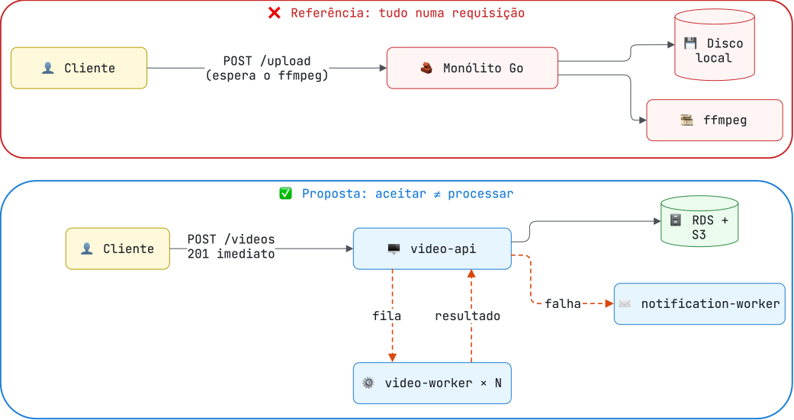

# RFC — Plataforma de processamento de vídeos

[← Requisitos](01-requisitos.md) · [Arquitetura](README.md) · [HLD →](03-hld.md)

| Campo | Valor |
|---|---|
| Status | Implementada; validação operacional registrada em [Requisitos e evidências](01-requisitos.md#evidências-de-execução) |
| Autor | Frederico Ferreira |
| Escopo | Processamento de vídeos multiusuário, assíncrono, em AWS Academy Learner Lab |
| Decisões derivadas | [ADR-001](adr/ADR-001-estilo-arquitetural.md) a [ADR-014](adr/ADR-014-servicos-gerenciados.md) |

## Problema

> [!NOTE]
> **Contexto de negócio**
> A "FIAP X" tem um protótipo que recebe **um** vídeo e devolve um `.zip` com os frames extraídos. Precisa evoluir para um sistema **multiusuário**, com vários vídeos em processamento simultâneo, sem perder requisições em pico e avisando o usuário quando algo der errado.

O ponto de partida do desafio é uma aplicação de referência escrita em Go: um único arquivo que recebe o vídeo e, **na mesma requisição HTTP**, executa o `ffmpeg`, compacta os frames e só então responde. O próprio enunciado a descreve como feita sem boas práticas de arquitetura. Os problemas concretos:

| Problema na referência | Consequência |
|---|---|
| Processamento síncrono dentro da requisição | A conexão fica presa pelo tempo inteiro da extração; vídeos longos estouram timeouts de proxy e do cliente |
| Sem fila nem separação de workers | Não há como processar vários vídeos em paralelo de forma controlada nem absorver picos |
| Estado em disco local (`uploads/`, `outputs/`) | Nada sobrevive a um restart e não é possível ter mais de uma instância |
| Sem banco de dados | Status é inferido listando arquivos; não há histórico nem dono do vídeo |
| Sem autenticação | Qualquer pessoa vê e baixa qualquer vídeo |
| Sem aviso de erro | Uma falha só aparece para quem estiver olhando a resposta |

## Proposta

Separar **aceitar** o vídeo de **processar** o vídeo. A API responde assim que o arquivo está guardado e o pedido de processamento registrado; workers independentes consomem uma fila e publicam o resultado de volta; um serviço dedicado avisa o usuário em caso de falha.

Responsabilidades:

- **`video-api`**: autentica, recebe e autoriza operações, guarda o original, é a **única dona** do estado do vídeo e decide quando notificar.
- **`video-worker`**: executa o trabalho de CPU (`ffmpeg` e ZIP). Não tem banco; comunica o resultado por evento ([ADR-008](adr/ADR-008-status-por-evento.md)).
- **`notification-worker`**: entrega o e-mail ao usuário e, opcionalmente, alerta a operação.
- **`video-gateway`**: entrada HTTP única, com CORS, rate limit e correlation-id.
- **`web`**: interface React.

A comunicação de negócio entre serviços é assíncrona via Amazon SQS; o cliente usa HTTP pelo gateway. Toda a infraestrutura de dados e mensageria é gerenciada pela AWS ([ADR-014](adr/ADR-014-servicos-gerenciados.md)).

## Alternativas avaliadas

| Alternativa | Por que não foi adotada |
|---|---|
| Monólito com tarefas assíncronas internas | Resolveria o bloqueio da requisição, mas CPU do `ffmpeg` e tráfego da API disputariam o mesmo processo e escalariam juntos. O desafio também pede a demonstração de microsserviços ([ADR-001](adr/ADR-001-estilo-arquitetural.md)) |
| Decomposição mais granular (5+ serviços, Lambda, orquestrador) | Custo de montagem e operação desproporcional a um domínio linear (upload → processar → notificar) |
| Kafka ou RabbitMQ como broker | O requisito é fila de trabalho, não log de eventos; um broker próprio exigiria estado no cluster ([ADR-002](adr/ADR-002-broker.md)) |
| Worker gravando status direto no banco da API | Acoplaria o worker ao schema de outro serviço ([ADR-008](adr/ADR-008-status-por-evento.md)) |
| Execução local (Docker Compose/kind) em paralelo à nuvem | Dois caminhos de execução para manter; a AWS foi validada ao vivo ([ADR-012](adr/ADR-012-aws-eks.md)) |

## Fora do escopo

Streaming em tempo real, execução completa offline, múltiplas regiões, Saga de negócio (não há passo a compensar: uma falha marca o vídeo e notifica), Event Sourcing ([ADR-013](adr/ADR-013-sem-cqrs.md)) e autenticação em Lambda ([ADR-005](adr/ADR-005-autenticacao.md)).

## Critérios de aceite

A proposta é considerada atendida quando, no ambiente implantado:

1. Dois vídeos são processados simultaneamente, com escala automática e retorno ao mínimo.
2. Um pico acima da cota é recusado de forma explícita (429), sem perder nenhum upload aceito.
3. Um worker derrubado no meio do processamento não perde o vídeo.
4. Uma indisponibilidade da fila não perde uploads aceitos.
5. Um arquivo inválido termina em `FAILED` e o usuário recebe o e-mail.

Os cinco critérios foram verificados em 27/09/2026 — ver [evidências](01-requisitos.md#evidências-de-execução).

[← Requisitos](01-requisitos.md) · [Arquitetura](README.md) · [HLD →](03-hld.md)
