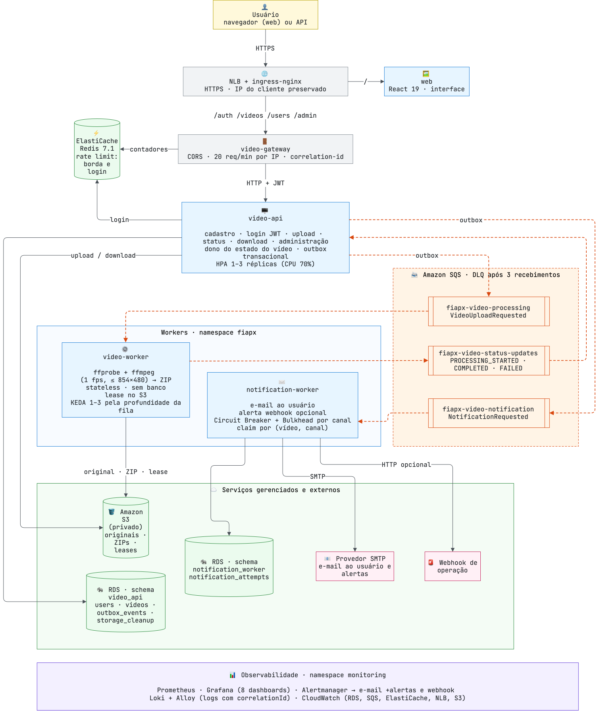
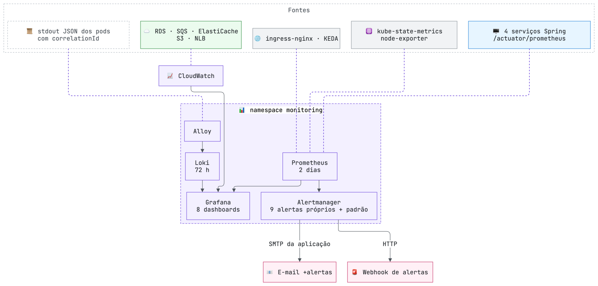

# HLD — Visão de alto nível

[← RFC](02-rfc.md) · [Arquitetura](README.md) · [LLD →](04-lld.md)

## 1. Componentes

São **três serviços de negócio**, **um gateway** e **um frontend**: cinco imagens implantadas no EKS. Dados, filas e cache são serviços gerenciados da AWS.

Setas contínuas são chamadas diretas; tracejadas, transporte assíncrono por fila. Os dois schemas ficam na mesma instância RDS. O gateway não encaminha chamadas aos workers.

| Componente | Responsabilidade | Estado próprio | Escala |
|---|---|---|---|
| `video-gateway` | Roteamento, CORS, rate limit por IP do cliente, início do correlation-id | nenhum (contadores no Redis) | réplica fixa |
| `video-api` | Autenticação, upload, status, download, administração; dono do ciclo de vida do vídeo | schema `video_api` | HPA por CPU (1–3) |
| `video-worker` | Extração com `ffmpeg` e geração do ZIP; sem banco | nenhum (lease no S3) | KEDA pela fila (1–3) |
| `notification-worker` | E-mail ao usuário e alerta operacional, isolados por canal | schema `notification_worker` | réplica fixa |
| `web` | Interface React | nenhum | réplica fixa |

## 2. Fluxos principais

### Upload e processamento com sucesso

O upload em três fases (reserva, envio, confirmação) evita manter transação e conexão de banco abertas durante o envio ao S3 e garante limpeza de objetos órfãos — detalhes no [LLD](04-lld.md#upload-em-três-fases).

### Falha e notificação

Erros de formato, duração ou extração produzem `PROCESSING_FAILED`. Falhas transitórias de infraestrutura mantêm a mensagem disponível para reentrega. O consumidor da DLQ de processamento produz um resultado terminal, recuperando sucesso se o ZIP já existir. A aceitação pelo SMTP não prova a chegada: o E2E confirma a mensagem na caixa de entrada por IMAP ([ADR-011](adr/ADR-011-notificacao.md)).

## 3. Implantação na AWS

- **Provisionamento:** Terraform cria VPC, EKS, RDS, ElastiCache, SQS, ECR e parâmetros SSM; os buckets S3 são criados por script, por uma restrição do laboratório ([ADR-014](adr/ADR-014-servicos-gerenciados.md)). Não há recurso com estado dentro do cluster além do volume do Loki.
- **Identidade:** o laboratório não permite criar roles; nós e pods usam o `LabRole` pela cadeia padrão do SDK (IMDS com hop limit 2). Não há IRSA por serviço.
- **Exposição:** um único NLB com `externalTrafficPolicy=Local`, que preserva o IP do cliente até o gateway — requisito do rate limit por cliente.
- **Segredos:** senha do banco, segredo JWT e senha do admin ficam no SSM e viram um Secret Kubernetes por serviço, só com as chaves que ele usa.

## 4. Escala e limites

| Alvo | Mecanismo | Limites |
|---|---|---|
| `video-api` | HPA por CPU, alvo 70% | 1 a 3 réplicas |
| `video-worker` | KEDA pela fila SQS, 1 mensagem por réplica, consulta a cada 15 s | 1 a 3 réplicas; a expansão leva de 30 a 60 s (leitura da fila + subida do pod) |
| Borda | Rate limit por IP do cliente, família de rota e método | 20 requisições por minuto; excedente recebe 429 |
| Upload | Multipart | até 500 MB |
| Processamento | `ffmpeg` com timeout | vídeo de até 1.800 s; 1 frame/s; até 1.800 frames; resolução limitada a 854 × 480 preservando a proporção; 15 min por vídeo |

No scale-down, o pod removido deixa de buscar mensagens e **termina o vídeo em andamento** antes de sair, com prazo de até 17 minutos ([ADR-010](adr/ADR-010-kubernetes-sem-service-mesh.md)). A capacidade é finita: acima de 3 workers a fila cresce, e isso é monitorado.

## 5. Padrões aplicados

| Padrão | Onde e por quê |
|---|---|
| Arquitetura hexagonal | Domínio separado de adapters de HTTP, banco, S3 e SQS; regras verificadas por ArchUnit em cada serviço |
| Outbox transacional | `video-api`: pedidos de processamento e de notificação saem na mesma transação do estado ([ADR-003](adr/ADR-003-entrega-e-idempotencia.md)) |
| Idempotência | Lease no S3 e reaproveitamento de ZIP no worker; estados terminais que não regridem na API; reivindicação por vídeo/canal na notificação |
| Entrega pelo menos uma vez | SQS Standard pode repetir mensagens; consumidores são idempotentes por construção |
| Isolamento de falhas | Circuit Breaker e Bulkhead por canal de notificação; filas independentes para processamento, resultados e notificações |
| Concorrência | Optimistic locking no vídeo, leases com token de propriedade na outbox, workers independentes |
| Rate limiting | Redis para login (por e-mail) e para a borda (por IP do cliente); não há controle de admissão pela profundidade da fila |

Não há tabela de jobs, chaves de idempotência genéricas, event store nem cache de status.

## 6. Observabilidade

**Rastreio de uma requisição.** O `video-gateway` gera (ou reaproveita) o `X-Correlation-Id`, devolve-o na resposta e o repassa à API. O id é gravado com cada evento da outbox e viaja como atributo das mensagens SQS; cada serviço o coloca no MDC, então **toda linha de log** do fluxo carrega o mesmo `correlationId`. No Grafana, o dashboard *Logs da aplicação* busca esse id (ou o `videoId`) e mostra o caminho completo: gateway → API → worker → notificação.

| Dashboard | Fonte | Mostra |
|---|---|---|
| Resultados de vídeos · Tempo até o resultado · Erros de processamento e circuit breakers | Prometheus | Métricas de negócio: volume por status, duração de ponta a ponta, taxa de falha, estado dos circuitos |
| Saúde dos serviços | Prometheus | Pods prontos, reinícios, req/s, latência p95, 4xx/5xx, erros de log, heap, GC, pool do banco, memória |
| Autoscaling e borda | Prometheus | Tráfego e 429 no ingress, fila, métrica do KEDA contra réplicas, HPA da API |
| Logs da aplicação | Loki | Logs de todos os serviços, filtráveis por serviço e por `correlationId`/`videoId` |
| Serviços AWS | CloudWatch | RDS, SQS (idade da mensagem, DLQs), ElastiCache, NLB e S3 |
| Alertas | Prometheus | Críticos e avisos disparando, alertas da aplicação (`Fiapx*`), histórico e se o Alertmanager está recebendo |

São oito dashboards próprios (tag `fiapx`); os prontos do `kube-prometheus-stack` (Kubernetes e nós) também ficam disponíveis.

**Alertas.** O Alertmanager envia cada alerta por **e-mail**, para o endereço `+alertas` do remetente da aplicação e pelo mesmo SMTP, e por **webhook**. Alertas `info` e os auxiliares do stack (`Watchdog`, `InfoInhibitor`) não viram notificação. Além das regras padrão do stack (pod em CrashLoop, réplicas divergentes, disco dos nós), há nove regras próprias:

| Alerta | Severidade | Dispara quando |
|---|---|---|
| `FiapxServiceDown` | crítico | Um deployment do namespace `fiapx` fica sem réplica disponível por 2 min |
| `FiapxHighErrorRate` | crítico | Mais de 5% de respostas 5xx por 5 min |
| `FiapxEmailCircuitOpen` | crítico | Circuit breaker do e-mail aberto por 1 min: usuários não estão sendo avisados |
| `FiapxHighLatency` | aviso | p95 das leituras acima de 1 s por 10 min (download excluído) |
| `FiapxProcessingFailureRate` | aviso | Mais de 20% dos vídeos em `FAILED` em 15 min (com ao menos 5 vídeos) |
| `FiapxWorkerCapacityExhausted` | aviso | KEDA no teto de réplicas por 10 min com a fila acumulando |
| `FiapxNotificationErrors` | aviso | Mais de 5 erros de log no `notification-worker` em 10 min |
| `FiapxQueueDepthHigh` | aviso | Mais de 50 mensagens prontas numa fila por 2 min |
| `FiapxDeadLetterQueueNotEmpty` | aviso | Qualquer mensagem retida numa DLQ por 1 min |

Decisão e histórico no [ADR-006](adr/ADR-006-observabilidade.md).

As configurações executáveis estão em [manifests](../../k8s/apps/base/), [add-ons](../../k8s/addons/) e [Terraform](../../k8s/terraform/aws/). Antes do deploy, consulte o [guia do ambiente](../aws-account-setup.md).

[← RFC](02-rfc.md) · [Arquitetura](README.md) · [LLD →](04-lld.md)
