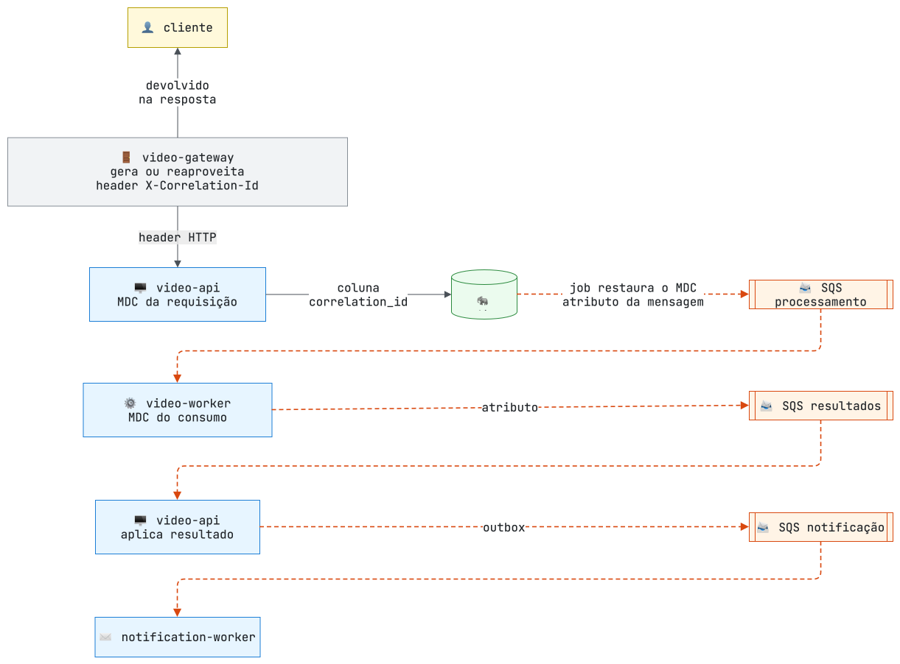

# LLD — Dados, contratos e mecanismos

[← HLD](03-hld.md) · [Arquitetura](README.md) · [Riscos e resiliência →](05-riscos-e-resiliencia.md)

Detalhamento para quem vai manter o código. As [migrações Flyway](../../video-api/src/main/resources/db/migration/) são a fonte completa de tipos e índices; os números citados aqui vêm dos arquivos de configuração indicados.

## 1. Modelo de dados

### `video_api`

- `aggregate_id` correlaciona o evento com o vídeo, sem FK.
- `user_id` aceita nulo apenas para registros legados; novos uploads exigem usuário. A FK sem cascade é o motivo de a exclusão de usuário e o upload se coordenarem por trava ([seção 4](#upload-em-três-fases)).
- `version` implementa optimistic locking na aplicação de resultados.
- `storage_cleanup` tem `(bucket, object_key)` único e serve a dois usos: exclusões pendentes e **reservas** de upload.

### `notification_worker`

`video_id` é correlação, sem FK entre schemas. Um índice único parcial em `(video_id, channel)` cobre os status `SENDING` e `SENT`: só uma execução por vídeo e canal consegue reivindicar o envio. Uma reivindicação `SENDING` abandonada há mais de 2 minutos (pod morto no meio) é liberada para a próxima tentativa.

## 2. Estados do vídeo

O consumidor ignora eventos para vídeos em estado terminal. As transições diretas de `QUEUED` para terminal acomodam a entrega fora de ordem do SQS Standard: um `PROCESSING_STARTED` atrasado não regride o estado. A exclusão de um vídeo só é aceita em estado terminal (HTTP 409 antes disso), porque o worker ainda pode gravar o ZIP.

## 3. Contratos

### HTTP (pelo `video-gateway`)

| Operação | Endpoint | Regra |
|---|---|---|
| Cadastro e login | `POST /auth/register`, `POST /auth/login` | Cadastro público; login emite JWT; 5 falhas por e-mail a cada 60 s geram 429 |
| Upload e listagem | `POST /videos`, `GET /videos` | Usuário autenticado; listagem paginada, só do próprio usuário |
| Detalhe e ZIP | `GET /videos/{id}`, `GET /videos/{id}/download` | Só o dono (vídeo alheio responde 404); ZIP apenas em `COMPLETED` |
| Exclusão | `DELETE /videos/{id}` | Dono ou administrador; apenas em estado terminal |
| Troca de senha | `PUT /users/me/password` | Reemite o token, porque a troca revoga os anteriores |
| Administração | `/admin/users`, `/admin/videos` | Papel `ADMIN` |

Toda resposta passa pelo gateway com o header `X-Correlation-Id`. O JWT identifica o usuário por `sub`; a API valida assinatura, expiração, existência do usuário e revogação (`tokens_valid_after`). Métodos e DTOs completos estão no contrato OpenAPI e na [collection Postman](../postman/fiapx-video-api.postman_collection.json).

### Filas SQS

| Fila | Produtor → consumidor | Mensagem |
|---|---|---|
| `fiapx-video-processing` | outbox da API → `video-worker` | `VideoUploadRequested` |
| `fiapx-video-status-updates` | `video-worker` → API | `PROCESSING_STARTED`, `PROCESSING_COMPLETED`, `PROCESSING_FAILED` |
| `fiapx-video-notification` | outbox da API → `notification-worker` | `NotificationRequested` (com o e-mail do destinatário) |

Cada fila tem uma DLQ com sufixo `-dlq`, após 3 recebimentos. Toda mensagem carrega `eventId`, versão de contrato e `correlationId` (no corpo e como atributo): servem para idempotência, compatibilidade e rastreio, não transformam o SQS Standard em entrega exatamente uma vez.

## 4. Mecanismos

### Upload em três fases

O envio de até 500 MB ao S3 acontece **fora** de qualquer transação, e uma reserva de limpeza garante que nenhuma falha deixe objeto órfão no bucket.

A trava do usuário na fase 3 é a mesma proteção contra exclusão concorrente de antes, agora mantida por milissegundos em vez de durante todo o envio.

### Outbox e publicação

Um job agendado (a cada 3 s, até 50 eventos por ciclo) reivindica um evento por vez com `FOR UPDATE SKIP LOCKED`, um lease de 30 s (`locked_until`) e um token de propriedade (`locked_by`). A publicação acontece fora da transação; só depois da confirmação do SQS o evento é marcado como publicado, e apenas por quem ainda detém o token. Como o job roda fora de qualquer requisição, ele **restaura o `correlationId` gravado com o evento** no MDC durante a publicação.

A janela entre "SQS confirmou" e "marcado como publicado" pode gerar duplicata se o pod morrer exatamente ali — por isso os consumidores são idempotentes.

### Consumo SQS, heartbeat e desligamento

Cada serviço tem seu próprio consumidor (`SqsQueueConsumer`), por decisão de manter os projetos independentes. No `video-worker`:

- **Heartbeat imediato:** a visibilidade cai do padrão da fila (960 s, dimensionado para o `ffmpeg`) para 120 s assim que a mensagem chega. Se o pod morrer, a mensagem volta em até 2 minutos, e não em 16.
- **Desligamento gracioso:** o SIGTERM do scale-down não interrompe o `ffmpeg`. Uma mensagem recebida já durante o desligamento é devolvida à fila na hora (visibilidade 0).
- **Falha no handler:** a mensagem não é apagada e reaparece em até 120 s; após 3 recebimentos, vai para a DLQ.
- **Lease no S3:** além da visibilidade, o worker mantém um lease de 90 s (renovado a cada 20 s) no bucket de resultados, para que duas réplicas nunca processem o mesmo vídeo ao mesmo tempo.

### Propagação do `correlationId`

Com o id no MDC, o formato de log estruturado (logstash) o inclui em cada linha. Os logs levam ids e tamanhos, nunca o nome original do arquivo nem o e-mail do usuário.

### Rate limit da borda

A chave do contador no Redis é `IP do cliente : família de rota : método`, com `:download` separado, para que o polling de status não consuma a cota de upload nem de login. A janela é fixa de 60 s com 20 requisições. O IP vem do primeiro valor de `X-Forwarded-For`, o que só é o IP real do cliente porque o Service do ingress usa `externalTrafficPolicy=Local` ([ADR-009](adr/ADR-009-api-gateway.md)).

[← HLD](03-hld.md) · [Arquitetura](README.md) · [Riscos e resiliência →](05-riscos-e-resiliencia.md)
