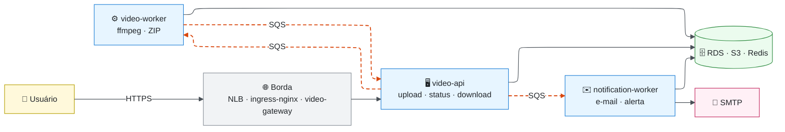

# Arquitetura — FIAP X

Documentação de arquitetura da plataforma de processamento de vídeos construída para o [Hackathon da Fase 5](../enunciado.md). Revisão: **27/09/2026**.

O sistema recebe vídeos de usuários autenticados, processa os arquivos de forma assíncrona e disponibiliza um ZIP com os frames extraídos. A API foi separada do processamento para escalar os workers sem manter a requisição HTTP aberta durante a extração, que era o principal problema da [aplicação de referência](02-rfc.md#problema).

> [!IMPORTANT]
> Os documentos descrevem a implementação versionada. A comprovação operacional vem das execuções registradas no ambiente AWS (CI, E2E, concorrência e resiliência), resumidas em [Requisitos e evidências](01-requisitos.md#evidências-de-execução) e em [Riscos e resiliência](05-riscos-e-resiliencia.md). Scripts existentes não substituem execução.

## Mapa dos documentos

| # | Documento | Responde a | Público principal |
|---|---|---|---|
| 1 | [Requisitos e evidências](01-requisitos.md) | O que o desafio pede, onde cada item foi atendido e como foi comprovado | Avaliação |
| 2 | [RFC — proposta adotada](02-rfc.md) | Qual problema existia, que solução propus e o que ficou fora do escopo | Avaliação, arquitetura |
| 3 | [HLD — visão de alto nível](03-hld.md) | Quais componentes existem, como conversam, onde rodam e como são observados | Arquitetura, operação |
| 4 | [LLD — dados, contratos e mecanismos](04-lld.md) | Como os dados são modelados, quais contratos existem e como funcionam outbox, consumo SQS e upload | Desenvolvimento |
| 5 | [Riscos e resiliência](05-riscos-e-resiliencia.md) | O que pode falhar, como o sistema se protege e o que os testes de falha mostraram | Operação, avaliação |
| — | [ADRs — registro de decisões](adr/README.md) | Por que cada decisão foi tomada, que alternativas foram descartadas e como a decisão evoluiu | Todos |
| — | [RFC-002 — Spring Cloud Gateway vs Kong](rfc/RFC-002-spring-cloud-gateway-vs-kong.md) | Comparação detalhada que embasou o ADR-009 | Arquitetura |

**Leitura sugerida:** requisitos → RFC → HLD → LLD → ADRs. Para executar o projeto, comece pelo [README principal](../../README.md); para o domínio, pelos artefatos de [DDD](../ddd/context-map.md).

## Visão em uma imagem

Linhas contínuas são chamadas síncronas; tracejadas, mensagens em fila. O detalhamento está no [HLD](03-hld.md).

## Síntese

> [!NOTE]
> **O que fica na memória**
> - A decisão mais importante não é tecnológica, é de **escopo**: três serviços de negócio focados, não uma decomposição mais granular — o domínio é linear (upload → processar → notificar) e não tem passo a compensar ([ADR-001](adr/ADR-001-estilo-arquitetural.md)).
> - Fila (Amazon SQS) + workers escaláveis resolvem RF1 e RF2 juntos: throughput paralelo e resiliência a pico são o **mesmo mecanismo**.
> - Outbox, idempotência, optimistic locking, leases e DLQ resolvem problemas genéricos de sistemas distribuídos, independentes do domínio.
> - Serverless, Saga e CQRS foram descartados conscientemente: nenhum requisito deste desafio os justifica.
> - A capacidade é finita e isso é explícito: a borda recusa com 429 e o alerta `FiapxWorkerCapacityExhausted` avisa quando os workers chegam ao teto. O controle de admissão pela profundidade da fila continua fora do escopo.

## Convenções

- **Diagramas** em Mermaid, dentro do próprio Markdown, para que sejam versionados junto com o texto.
- **Fonte da verdade:** quando um documento e o código divergirem, valem o código, as migrações Flyway, os manifests em [`k8s/`](../../k8s/) e o Terraform em [`k8s/terraform/aws/`](../../k8s/terraform/aws/). Os documentos citam o arquivo de origem sempre que um número é relevante.
- **ADRs** são imutáveis na decisão e cumulativos no histórico: uma revisão acrescenta uma entrada datada em vez de reescrever o passado.
