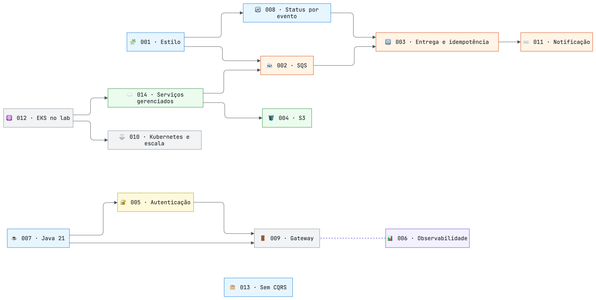

# Registro de decisões de arquitetura (ADRs)

[← Arquitetura](../README.md)

Cada ADR registra uma decisão, o contexto em que foi tomada, as alternativas descartadas e as consequências aceitas. O **histórico de revisões** de cada ADR registra o que mudou depois, e por quê — em geral, algo que um teste ou uma revisão revelou.

| ADR | Decisão | Tema | Revisado em 27/09/2026 |
|---|---|---|:---:|
| [001](ADR-001-estilo-arquitetural.md) | Três serviços de negócio, gateway e frontend | Decomposição | |
| [002](ADR-002-broker.md) | Amazon SQS Standard com DLQ | Mensageria | ✔ |
| [003](ADR-003-entrega-e-idempotencia.md) | Outbox, leases, upload em três fases e heartbeat imediato | Entrega e idempotência | ✔ |
| [004](ADR-004-armazenamento.md) | S3 privado, download por streaming | Armazenamento | |
| [005](ADR-005-autenticacao.md) | JWT na API com revogação por data | Autenticação | |
| [006](ADR-006-observabilidade.md) | Prometheus, Loki, CloudWatch, alertas por e-mail e correlation-id | Observabilidade | ✔ |
| [007](ADR-007-runtime.md) | Java 21 e Spring Boot 4 com virtual threads | Runtime | |
| [008](ADR-008-status-por-evento.md) | Worker publica resultados; a API é dona do estado | Integração | |
| [009](ADR-009-api-gateway.md) | Spring Cloud Gateway com rate limit por IP do cliente | Borda | ✔ |
| [010](ADR-010-kubernetes-sem-service-mesh.md) | EKS com HPA, KEDA e desligamento gracioso | Escala | ✔ |
| [011](ADR-011-notificacao.md) | E-mail ao usuário; webhook como alerta sem dados pessoais | Notificação | ✔ |
| [012](ADR-012-aws-eks.md) | EKS no Learner Lab como única execução | Plataforma | ✔ |
| [013](ADR-013-sem-cqrs.md) | Consulta direta de status, sem CQRS | Leitura | |
| [014](ADR-014-servicos-gerenciados.md) | RDS, SQS, ElastiCache e S3 gerenciados | Dados | ✔ |

As setas indicam dependência: a decisão de destino assume a de origem.

## Modelo

Novos ADRs seguem as seções: Contexto · Decisão · Alternativas consideradas · Consequências · Evidência (quando houver) · Histórico de revisões.

[← Arquitetura](../README.md)
