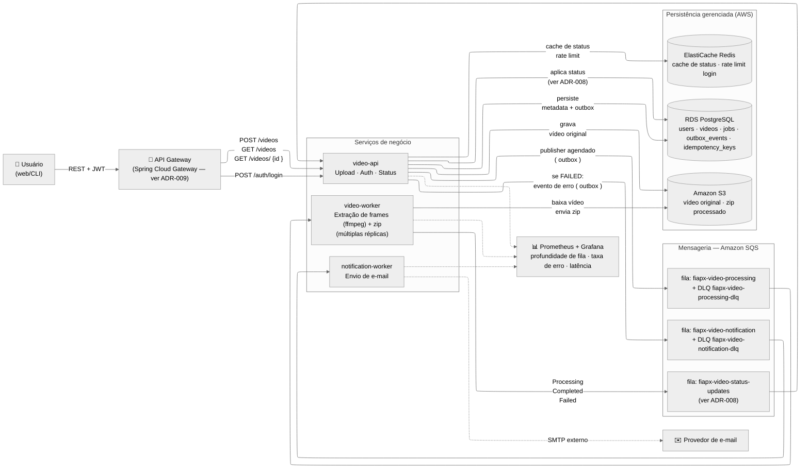
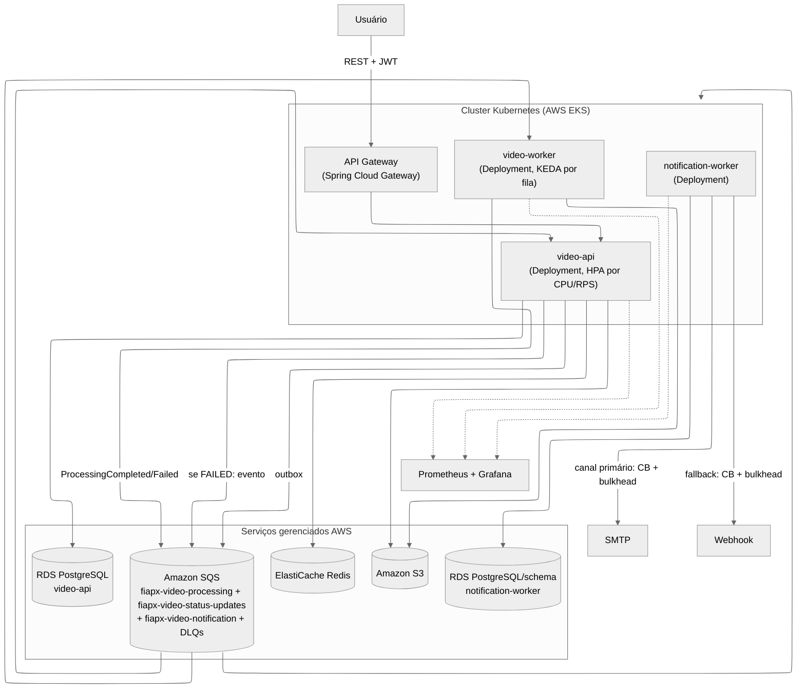
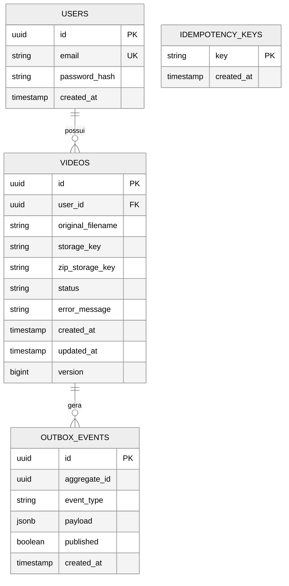
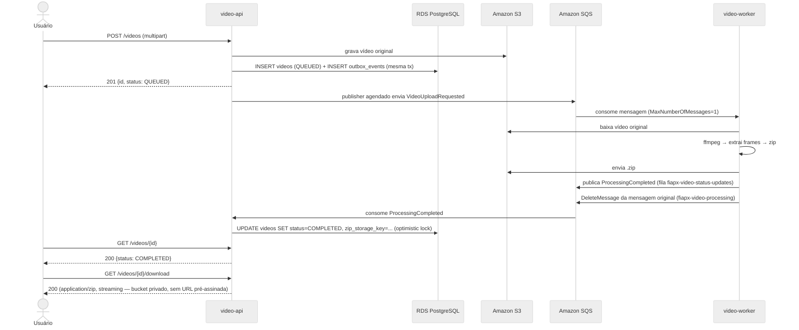
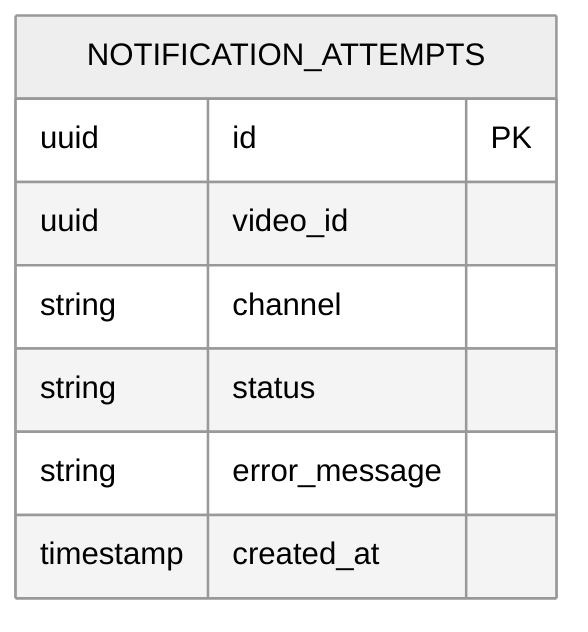

# Hackathon — Sistema de Processamento de Vídeos (FIAP X)

> [!NOTE]
> **Sobre este documento**
> Escrevi esta análise de arquitetura para o desafio da **Fase 5** ([enunciado original](../enunciado.md)) para ser **implementável**, não apenas teórica: registro cada decisão relevante como
> RFC (motivação e proposta), detalho em HLD/LLD (visão de containers e de componentes) e justifico em ADRs individuais. Meu fio condutor é aplicar deliberadamente os padrões e boas práticas que já consolidei nas Fases 1–4 do curso, adaptando — não copiando cegamente — para as restrições reais deste desafio.

---

## 1. Recapitulação do desafio

> [!NOTE]
> **Contexto de negócio**
> A "FIAP X" tem um protótipo que recebe **um** vídeo e devolve um `.zip` com os frames extraídos.
> Precisa evoluir para um sistema **multiusuário**, com múltiplos vídeos em processamento simultâneo, sem perder requisições em pico.

### Requisitos funcionais

| #   | Requisito                                                     | Onde é resolvido                                                                                                                                                                                  |
|-----|---------------------------------------------------------------|---------------------------------------------------------------------------------------------------------------------------------------------------------------------------------------------------|
| RF1 | Processar mais de um vídeo simultaneamente                    | Fila + N réplicas de `video-worker`, escaladas por KEDA conforme profundidade da fila                                                                                                             |
| RF2 | Não perder nenhuma requisição em pico de carga                | Outbox Pattern (upload nunca depende do processamento) + fila absorvendo o pico — ver [ADR-003](#adr-003--garantia-de-entrega-e-idempotência)                                                     |
| RF3 | Autenticação por usuário e senha                              | JWT emitido por `video-api`, secret único via Kubernetes Secret — ver [ADR-005](#adr-005--autenticação)                                                                                           |
| RF4 | Listagem do status dos vídeos por usuário                     | `GET /videos` direto no PostgreSQL do `video-api`, escopado pelo usuário do JWT — ver [ADR-013](#adr-013--sem-cqrsevent-sourcing-para-consulta-de-status)                                        |
| RF5 | Notificação ao usuário em caso de erro (e-mail ou outro meio) | `notification-worker` multicanal (e-mail + fallback webhook), cada canal isolado por Circuit Breaker + Bulkhead — ver [ADR-011](#adr-011--notificação-multicanal-como-incremento-não-como-núcleo) |

### Requisitos técnicos e entregáveis

| #    | Requisito                                                                            | Onde é resolvido                                                                                                                                                                                                         |
|------|--------------------------------------------------------------------------------------|--------------------------------------------------------------------------------------------------------------------------------------------------------------------------------------------------------------------------|
| RT1  | Persistência de dados                                                                | RDS PostgreSQL (schema próprio por serviço) + Amazon S3 (object storage) — ver [ADR-004](#adr-004--armazenamento-de-vídeo-e-zip-processado) e [ADR-008](#adr-008--comunicação-de-status-entre-video-worker-e-video-api-evento-não-escrita-direta) |
| RT2  | Arquitetura escalável                                                                | HPA (`video-api`) + KEDA (`video-worker`) em Kubernetes (AWS EKS) — ver [ADR-010](#adr-010--deploy-em-kubernetes-gerenciado-sem-service-mesh)                                  |
| RT3  | Versionamento no GitHub                                                              | Repositório versionado, branch `main` protegida, PRs com CI obrigatório                                                                                                                                                  |
| RT4  | Testes automatizados                                                                 | Testes de unidade (domínio) + integração (Testcontainers para Postgres, LocalStack para S3/SQS)                                                                                                                                            |
| RT5  | CI/CD                                                                                | GitHub Actions — build e testes em todo PR (`ci.yml`); **Qodana** e **análise de vulnerabilidades** (OWASP Dependency-Check + Trivy) como workflows sob demanda; deploy no EKS a partir da `main` (`cd-aws.yml`) |
| ENT1 | Documentação de arquitetura                                                          | Este documento                                                                                                                                                                                                           |
| ENT2 | Script de criação de banco/recursos                                                  | Migrações Flyway (`V1__init.sql` etc.) por serviço                                                                                                                                                                       |
| ENT3 | Link do GitHub + vídeo de até 10 min (documentação → arquitetura → demo funcionando) | —                                                                                                                                                                                                                        |

---

## 2. Padrões e decisões técnicas aplicadas

Nesta seção documento os padrões técnicos que apliquei nesta arquitetura, consolidados a partir do que estudei nas Fases 1–4 do curso — e o que **descartei deliberadamente**.

| Padrão/decisão                                                                              | Aplicação neste Hackathon                                                                                                                                                                               |
|---------------------------------------------------------------------------------------------|---------------------------------------------------------------------------------------------------------------------------------------------------------------------------------------------------------|
| Arquitetura Hexagonal + Clean Architecture (domínio isolado de infra, Regra da Dependência) | Cada serviço novo mantém domínio puro (`Video`, `ProcessingJob`) isolado de framework/storage/fila                                                                                                      |
| Decomposição por bounded context (DDD), nunca acesso direto ao banco de outro serviço       | 3 serviços com fronteiras claras (ingestão/API, processamento, notificação) — ver [ADR-001](#adr-001--estilo-arquitetural-para-um-hackathon-com-prazo-curto)                                            |
| Outbox Pattern (evita dual-write entre commit da entidade e publicação do evento)           | Aplicado na direção `video-api`→fila (upload) e, pelo [ADR-008](#adr-008--comunicação-de-status-entre-video-worker-e-video-api-evento-não-escrita-direta), também na direção `video-worker`→`video-api` |
| Idempotência via tabela `idempotency_keys` + deduplicação em consumidores                   | Aplicado no worker de processamento e no consumidor de notificação                                                                                                                                      |
| Retry + backoff + Circuit Breaker (Resilience4j) para chamadas externas instáveis           | Aplicado no envio de e-mail (SMTP externo) e em qualquer chamada síncrona entre serviços                                                                                                                |
| DLQ + `maxReceiveCount` + alarme para mensagens que falham repetidamente                    | Fila de processamento e fila de notificação têm DLQ dedicada                                                                                                                                            |
| Optimistic locking (`@Version`) para concorrência em updates da mesma linha                 | Atualização de status do vídeo por múltiplos eventos concorrentes (ex.: retry)                                                                                                                          |
| HPA (Horizontal Pod Autoscaler) para elasticidade sob carga                                 | Escala o worker de processamento — ver nota sobre KEDA na seção HLD                                                                                                                                     |
| JWT HS256 stateless, secret único compartilhado                                             | Fonte única de secret evita divergência entre réplicas — ver [ADR-005](#adr-005--autenticação)                                                                                                          |
| Banco relacional para dados transacionais (ACID)                                            | PostgreSQL para usuários, vídeos, jobs, outbox                                                                                                                                                          |
| Redis para rate limiting (contadores com TTL nativo)                                        | Rate limiting de borda no `video-gateway` (por IP, `X-Forwarded-For` atrás do ingress); ElastiCache no perfil `aws`                                                                                   |
| API Gateway como ponto único de entrada, desacoplando cliente da topologia                  | Gateway único na frente dos 3 serviços                                                                                                                                                                  |
| Serverless (Lambda) só quando o requisito pede explicitamente                               | **Não** aplicado por padrão aqui — o enunciado não exige serverless                                                                                                                                     |
| SAGA orquestrada para fluxos multi-etapa com compensação                                    | **Não aplicado** — o pipeline de vídeo é uma cadeia linear sem necessidade de compensação de negócio (ver [Riscos](#7-riscos-e-mitigação))                                                              |

> [!TIP]
> **Por que só 3 serviços, sem SAGA**
> Um domínio com bounded contexts genuinamente distintos e um fluxo transacional longo que precisa de compensação (ex.: cadastro, orçamento, execução, pagamento) justificaria mais serviços e um padrão SAGA. Considero o domínio deste hackathon mais simples — upload, processar, notificar — e acho que replicar uma decomposição mais granular seria **over-engineering fora do prazo de um hackathon**. Discuto isso formalmente no ADR-001.

> [!NOTE]
> **Artefatos de DDD deste hackathon**
> Os artefatos formais estão em: [Linguagem Ubíqua](../ddd/linguagem-ubiqua.md), [Event Storming](../ddd/event-storming.md), [Domain Storytelling](../ddd/domain-storytelling.md) e [Context Map](../ddd/context-map.md).

---

## 3. RFC — Arquitetura do Sistema de Processamento de Vídeos

| Campo      | Valor                                                        |
|------------|--------------------------------------------------------------|
| **Status** | Proposto                                                     |
| **Data**   | 2026-07-27                                                   |
| **Autor**  | Frederico Ferreira                                           |
| **Tags**   | hackathon, vídeo, microsserviços, mensageria, escalabilidade |

### Motivação

O protótipo apresentado no desafio processa um vídeo por execução, sem persistência, sem usuários e sem tolerância a falha. Preciso transformá-lo num serviço multiusuário que garanta throughput sob concorrência (RF1), resiliência a picos (RF2) e visibilidade de status/erro (RF4, RF5).

### Objetivos

- Nenhuma requisição de upload é perdida, mesmo sob pico (RF2) — resolvo isso com fila, não escalando o processamento síncrono.
- Processamento paralelo real de múltiplos vídeos (RF1) — resolvo isso com múltiplas réplicas do worker consumindo a mesma fila.
- Persistência e consulta de status por usuário (RF3, RF4, RT1).
- Notificação assíncrona e desacoplada do pipeline principal em caso de erro (RF5).

### Não objetivos

- Processamento em tempo real/streaming de vídeo (o enunciado pede extração de frames em lote, não um pipeline de baixa latência).
- Multi-região ou alta disponibilidade geográfica — deixo fora do escopo de um hackathon.

### Proposta resumida

Proponho três serviços deployáveis independentemente:
- **video-api** (upload, autenticação, consulta de status)
- **video-worker** (consome fila, extrai frames via `ffmpeg`, gera `.zip`)- **notification-worker** (consome eventos de erro/conclusão, envia e-mail)

Comunicando-se de forma síncrona (REST, cliente ↔ video-api) e assíncrona (fila Amazon SQS, video-api → video-worker → notification-worker), com RDS PostgreSQL para metadados, Amazon S3 para os binários de vídeo/zip, e ElastiCache Redis para rate limiting de borda — todos serviços gerenciados provisionados por Terraform, ver [ADR-014](#adr-014--serviços-gerenciados-aws-como-única-topologia).

### Alternativas consideradas e rejeitadas

| Alternativa                                                                   | Por que rejeitei                                                                                                                                                                                  |
|-------------------------------------------------------------------------------|---------------------------------------------------------------------------------------------------------------------------------------------------------------------------------------------------|
| Monólito único sem separação de processos                                     | Não atende RF1/RF2: processamento de vídeo é CPU-bound e de duração variável; rodar no mesmo processo/pod da API arrisca degradar o tempo de resposta do upload e da consulta de status sob carga |
| Decomposição mais granular (5+ serviços + Lambda + Step Functions/SQS na AWS) | Overhead de setup (múltiplos repositórios, pipelines, IAM, Terraform) desproporcional ao domínio, que não tem fluxo transacional multi-etapa com compensação de negócio                           |
| Kafka como broker                                                             | Ver [ADR-002](#adr-002--broker-de-mensageria)                                                                                                                                                     |
| Processar o vídeo de forma síncrona na própria requisição de upload           | Bloqueia a thread/conexão HTTP pelo tempo do processamento (segundos a minutos), inviabilizando RF1 (múltiplos vídeos simultâneos sem degradar a API)                                             |

---

## 4. HLD — High-Level Design

### Visão de containers

**Como leio o diagrama:** setas contínuas são chamadas síncronas (REST, leitura/escrita direta em banco/storage); setas tracejadas são assíncronas (mensageria, e-mail, telemetria). Dou a cada serviço seu próprio ciclo de deploy, e cada um pode escalar independentemente — em particular o `video-worker`, que é o único ponto genuinamente CPU-bound do sistema.

### Fluxo ponta a ponta

1. Cliente autentica (`POST /auth/login`) e recebe um JWT.
2. Cliente envia o vídeo (`POST /videos`); `video-api` grava o binário no object storage (chave `raw/{videoId}/source.{ext}`, nome original só como metadado) **fora de transação**, e depois cria a linha em `videos` com status `QUEUED` e o evento `VideoUploadRequested` na tabela `outbox_events` **na mesma transação** (curta), protegida por uma reserva de limpeza contra objeto órfão — ver a emenda "upload sem transação aberta" no ADR-003.
3. Um publisher agendado (mesmo padrão de Outbox descrito no ADR-003) reserva um lote de eventos não publicados (`FOR UPDATE SKIP LOCKED` + lease) e envia para a fila `fiapx-video-processing`; só marca como publicado após a resposta síncrona do `SendMessage` (SQS).
4. Qualquer réplica livre do `video-worker` consome a mensagem, publica `ProcessingStarted` (o `video-api` leva o vídeo de `QUEUED` a `PROCESSING`), baixa o vídeo do object storage, extrai frames com `ffmpeg` (com timeout), monta o `.zip`, envia para o object storage e publica um evento `ProcessingCompleted` (ou `ProcessingFailed`, com mensagem de erro) na fila `fiapx-video-status-updates` — o `video-worker` **nunca** escreve diretamente no Postgres do `video-api` (ver [ADR-008](#adr-008--comunicação-de-status-entre-video-worker-e-video-api-evento-não-escrita-direta)).
5. O `video-api` consome esse evento e aplica a mudança de status (`COMPLETED`/`FAILED`) ao seu próprio banco, com optimistic locking (`@Version`).
6. Se o status aplicado for `FAILED`, o `video-api` grava um evento de falha (mesmo padrão outbox) na fila `fiapx-video-notification`; o `notification-worker` consome e envia e-mail ao usuário.
7. Cliente consulta `GET /videos` (lista com status, direto no PostgreSQL) e, quando `COMPLETED`, `GET /videos/{id}/download` devolve o `.zip` em streaming pelo `video-api` (o bucket é privado; não há URL pré-assinada).

### Não perder requisição em pico (RF2)

- Fiz o `POST /videos` depender só de PostgreSQL + object storage (ambos rápidos para gravar metadado/binário) — **nunca** espera o processamento. A fila absorve o pico; o worker processa na velocidade que conseguir, sem derrubar a taxa de aceitação de novos uploads.
- Backpressure explícito: se a profundidade da fila ultrapassar um limiar configurável, `video-api` pode responder `429 Too Many Requests` com `Retry-After` em vez de aceitar uploads que ficariam na fila por tempo excessivo — não implementei isso por padrão no MVP.
- Escalo o `video-worker` horizontalmente via HPA. Uma extensão natural é escalar por profundidade de fila via KEDA em vez de (ou além de) CPU, já que um worker CPU-bound processando um vídeo grande pode ter CPU alta com fila ainda maior esperando.

### Topologia de implantação (Kubernetes gerenciado — AWS EKS)

Ver [ADR-010](#adr-010--deploy-em-kubernetes-gerenciado-sem-service-mesh) para a decisão e alternativas. Todos os componentes rodam num cluster Kubernetes gerenciado (AWS EKS), sem service mesh:

Dou ao `notification-worker` persistência própria (`PGN` no diagrama, ver [5.5](#55-notification-worker--persistência-própria)), fechando a regra "cada microsserviço com banco próprio" para os 3 serviços. Autoscaling: HPA (`video-api`, por CPU/RPS) + KEDA (`video-worker`, trigger `aws-sqs-queue` por profundidade de fila, autenticado pela identidade do nó — `LabRole`, sem IRSA no Learner Lab).

---

## 5. LLD — Low-Level Design

### 5.1 `video-api`

**Modelo de dados (PostgreSQL):**

Os `status` são `{QUEUED, PROCESSING, COMPLETED, FAILED}`. `version` é a coluna de optimistic locking (`@Version`) — uso ela para proteger contra updates concorrentes de status vindos de retries do worker.

**Contratos de API essenciais:**

| Método | Rota                    | Descrição                                                                                   |
|--------|-------------------------|---------------------------------------------------------------------------------------------|
| `POST` | `/auth/login`           | `{email, password}` → `{access_token, token_type: Bearer}` (JWT HS256, expiração curta)     |
| `POST` | `/videos`               | Multipart upload; cria `videos` (status `QUEUED`) + evento outbox; retorna `201` com o `id` |
| `GET`  | `/videos`               | Lista paginada dos vídeos do usuário autenticado (via claim do JWT), com `status`           |
| `GET`  | `/videos/{id}`          | Detalhe de um vídeo (status, erro se houver)                                                |
| `GET`  | `/videos/{id}/download` | Faz streaming do `.zip` (`application/zip`) quando `status = COMPLETED`; `409` caso contrário |

**Diagrama de sequência — upload até conclusão:**

### 5.2 `video-worker`

- Uso a fila `fiapx-video-processing`, com `MaxNumberOfMessages=1` por poll — processamento de vídeo é CPU-bound, então um único vídeo por pod já satura o paralelismo disponível (prefetch alto degradaria o throughput real).
- **Sem acesso a banco:** desde o [ADR-008](#adr-008--comunicação-de-status-entre-video-worker-e-video-api-evento-não-escrita-direta), o `video-worker` não tem credenciais nem conhecimento de schema do PostgreSQL do `video-api` — deixei ele stateless. Ao concluir (sucesso ou falha), publica um evento `ProcessingCompleted`/`ProcessingFailed` na fila `fiapx-video-status-updates`; quem aplica a mudança de status é o `video-api`, dono do dado.
- **Idempotência:** deixei a responsabilidade de deduplicar com o consumidor no `video-api` (verifica se o `video_id` do evento já está em `COMPLETED`/`FAILED` antes de aplicar — reaplicar o mesmo evento é inofensivo). Faço o `video-worker` só remover (`DeleteMessage`) a mensagem original de `fiapx-video-processing` **depois** de confirmar a publicação do evento de resultado — se o worker cair no meio do processamento, a mensagem não foi deletada e será reentregue após o visibility timeout, reprocessando do zero com segurança (o zip antigo, se existir, é sobrescrito).
- **Erro/retry/DLQ:** falhas transitórias (ex.: object storage momentaneamente indisponível) usam retry com backoff exponencial (Resilience4j); após esgotar tentativas (`maxReceiveCount`), a mensagem vai para `fiapx-video-processing-dlq` (redrive policy nativa do SQS), e o worker publica `ProcessingFailed` para que o `video-api` aplique `FAILED` e dispare a notificação.
- **Timeout:** o `ffmpeg` roda com prazo (`FFMPEG_TIMEOUT_MINUTES`, padrão 15 min; ao estourar, a árvore de processos é encerrada e o vídeo vai a `FAILED`); no SQS o visibility timeout da fila de processamento (960 s) é maior que esse prazo e o consumidor renova a visibilidade enquanto o handler roda — um vídeo muito maior que o esperado é justamente o risco registrado na seção 7.

### 5.3 Autenticação (`video-api`)

Uso JWT HS256, `sub` = `user_id`, expiração curta (ex.: 15 min), secret lido de uma única fonte (variável de ambiente/Secret do Kubernetes) e **nunca** gerado de forma independente por réplica — assim evito divergência de `JWT_SECRET` entre réplicas, um problema conhecido em deploys com múltiplas instâncias (causa falha de login intermitente, difícil de diagnosticar). Faço rate limiting de tentativas de login via Redis (`INCR` + `TTL`, padrão do Guia Database Engineering).

### 5.4 API Gateway (`video-gateway`)

Coloco o Spring Cloud Gateway na frente dos 3 serviços — ver [ADR-009](#adr-009--api-gateway-spring-cloud-gateway-em-vez-de-kong). Responsabilidades: roteamento (`/auth/**` → `video-api`, `/videos/**` → `video-api`), CORS, rate limiting de borda (complementar ao rate limiting de login já feito via Redis no `video-api`). **Não** valido JWT nele — cada serviço valida seu próprio token via filtro Spring Security compartilhado, o que mantém os serviços testáveis isoladamente sem precisar subir o gateway.

### 5.5 `notification-worker` — persistência própria

Dou ao `notification-worker` estado próprio, num banco (ou schema) próprio, mínimo:

O `channel` são `{EMAIL, WEBHOOK}` (o segundo só entra com a notificação multicanal — ver [ADR-011](#adr-011--notificação-multicanal-como-incremento-não-como-núcleo)). `video_id` é só uma referência de correlação (não há FK real — o `notification-worker` não acessa o banco do `video-api`, coerente com o ADR-008). Uso essa tabela tanto como log quanto como chave de idempotência: antes de reenviar, verifico se já existe um registro `SENT` para o mesmo `video_id` + `channel`.

---

## 6. ADRs

### ADR-001 — Estilo arquitetural para o hackathon

| Campo                     | Valor                                                                                                                                                                                                                                                                                                                                            |
|---------------------------|--------------------------------------------------------------------------------------------------------------------------------------------------------------------------------------------------------------------------------------------------------------------------------------------------------------------------------------------------|
| Status                    | Aceito                                                                                                                                                                                                                                                                                                                                           |
| Contexto                  | O enunciado pede explicitamente "desenvolvimento de microsserviços" como conceito a demonstrar, mas o domínio (upload → processar → notificar) é simples. Um domínio com bounded contexts distintos e fluxo transacional com compensação (SAGA) justificaria mais serviços — não é o caso aqui                                                   |
| Decisão                   | Escolhi 3 serviços deployáveis independentemente — `video-api`, `video-worker`, `notification-worker` — cada um com responsabilidade única e escalabilidade própria, sem SAGA (não há compensação de negócio: o pipeline é linear, e uma falha de processamento simplesmente marca o vídeo como `FAILED`, sem necessidade de desfazer passos anteriores) |
| Alternativas consideradas | (a) **Monólito único** — rejeitei, não isola o processamento CPU-bound da API; (b) **Decomposição mais granular** (5+ serviços + Lambda + orquestração explícita) — rejeitei, overhead de setup desproporcional ao domínio                                                                                                                 |
| Consequências             | **Positivo**: setup mais rápido, ainda demonstra decomposição em microsserviços de forma justificada.  **Negativo**: menos "impressionante" por tudo que estudamos no curso porém no curso de arquitetura devemos observar esses trade-offs assim como profissionalmente                                                                     |

### ADR-002 — Broker de mensageria

| Campo                     | Valor                                                                                                                                                                                                                                                                                                                                |
|---------------------------|---------------------------------------------------------------------------------------------------------------------------------------------------------------------------------------------------------------------------------------------------------------------------------------------------------------------------------------|
| Status                    | Aceito                                                                                                                                                                                                                                                                                                                               |
| Contexto                  | O enunciado sugere RabbitMQ ou Kafka; a implantação alvo é AWS EKS (ADR-012), então o broker precisa ser um serviço gerenciado sem operação própria no cluster                                                                                                                                                           |
| Decisão                   | Amazon SQS (Standard) — modelo de fila de trabalho com `SendMessage`/`DeleteMessage`, redrive policy nativa para DLQ (`maxReceiveCount`), `MaxNumberOfMessages=1` para controlar concorrência de um worker CPU-bound, visibility timeout (960 s) para o tempo real do `ffmpeg`                                                                                                                                                                             |
| Alternativas consideradas | Kafka — rejeitei: seu ganho central é replay de log/particionamento para múltiplos consumidores independentes do mesmo stream, o que não é o requisito aqui (é uma fila de trabalho de processamento único por vídeo, não um log de eventos replayable); overhead operacional (partições, consumer groups) desproporcional ao prazo. RabbitMQ (self-hosted ou Amazon MQ) — rejeitei: exigiria operar um broker com estado dentro do cluster (PVC, backup) ou pagar por um serviço gerenciado fora da lista liberada do Learner Lab, sem ganho sobre SQS para uma fila de trabalho simples |
| Consequências             | **Positivo**: sem infraestrutura de mensageria própria para operar; redrive automático e métricas de profundidade de fila nativas do CloudWatch/SQS. **Negativo**: SQS Standard entrega at-least-once — idempotência continua obrigatória (ADR-003); se o hackathon evoluir para exigir replay de eventos ou múltiplos consumidores independentes do mesmo evento, Kafka passaria a ser mais adequado                                                                 |

### ADR-003 — Garantia de entrega e idempotência

| Campo                     | Valor                                                                                                                                                                                                                                |
|---------------------------|--------------------------------------------------------------------------------------------------------------------------------------------------------------------------------------------------------------------------------------|
| Status                    | Aceito                                                                                                                                                                                                                               |
| Contexto                  | Um evento de upload não pode se perder entre o commit da entidade e a publicação na fila (dual-write); o SQS entrega at-least-once, então consumidores podem receber a mesma mensagem mais de uma vez                           |
| Decisão                   | Escolhi o Outbox Pattern (evento gravado na mesma transação da entidade, publisher agendado reprocessa não publicados) + verificação de status antes de reprocessar no worker — padrão consolidado para esse problema em sistemas distribuídos |
| Alternativas consideradas | Publicar direto na fila dentro da transação (rejeitei — mesmo problema de dual-write descrito no contexto acima); exactly-once via transações Kafka (rejeitei junto com Kafka no ADR-002)                                          |
| Consequências             | **Positivo**: nenhuma perda de evento, reprocessamento seguro. **Negativo**: latência adicional do polling do publisher (aceitável — não é um requisito de tempo real)                                                           |

**Emenda — lease na outbox, `eventId` e idempotência por construção.** O publisher reserva o lote com `SELECT ... FOR UPDATE SKIP LOCKED` e um `locked_until` de 30 s (migration `V5__outbox_lease.sql`), publica **fora** da transação e só marca `published` após a confirmação do broker; falha libera o lease e incrementa `attempts`. Assim duas réplicas do `video-api` não publicam o mesmo evento, e um lease expirado (pod morto no meio) é reaproveitado. Cada evento carrega `eventId` (id da linha da outbox) e `contractVersion` no payload e como header/atributo de mensagem, junto do `correlationId`; o `video-worker` propaga o `eventId` no resultado. Reprocessar o mesmo evento no worker é idempotente por construção — `ApplyProcessingResultUseCase` ignora eventos para vídeo em estado terminal — sem "claim" em banco compartilhado (ADR-008).

**Emenda — upload sem transação aberta durante o envio ao S3.** O `RequestVideoProcessingUseCase` abria uma transação, travava o usuário (`FOR UPDATE`, proteção contra exclusão concorrente) e só fechava depois de mandar até 500 MB ao S3: uploads do mesmo usuário ficavam serializados, cada envio lento segurava uma conexão do pool, e um S3 que concluía antes de um rollback deixava um objeto sem registro. O upload agora tem três fases: (1) transação curta que confere o usuário e grava uma **reserva de limpeza** da chave em `storage_cleanup` com `retry_at = now() + 1h`; (2) envio ao S3 fora de transação; (3) transação curta que trava o usuário (a mesma proteção de antes, agora por milissegundos), cancela a reserva e grava vídeo + outbox atomicamente. Qualquer falha depois da fase 1 (S3, usuário excluído no meio, rollback da fase 3) deixa a reserva de pé, e o job de `PersistentStorageCleanup` apaga o objeto órfão quando ela vence. Se a fase 3 encontrar a reserva já consumida (envio acima de 1h), o upload é rejeitado em vez de gravar um vídeo apontando pra um objeto apagado.

**Emenda — propriedade da reserva (lock token) na outbox.** O lease por si só (`locked_until`) não identifica quem o detém: se o lote demorasse mais que os 30 s pra publicar, o lease expirava e outra réplica podia reivindicar a mesma linha; a conclusão tardia da réplica antiga então sobrescrevia a reserva nova (confirmava o que a réplica nova ainda processava, ou liberava a reserva dela). A migration `V9__outbox_lock_token.sql` adiciona `locked_by` (um token gerado a cada reivindicação); `markPublished`/`releaseAfterFailure` agora exigem esse token de volta e viram no-op quando ele não bate mais com a reserva atual.

**Emenda — idempotência dos efeitos externos (ffmpeg e envio de notificação).** A garantia "idempotente por construção" do `video-worker` cobria apenas a chave de saída (`processed/{id}/{id}.zip` sobrescrita), não o trabalho em si: uma reentrega da fila fazia o `ffmpeg` rodar de novo à toa. `ProcessVideoUseCase` agora testa `storageClient.exists(...)` na chave de saída antes de baixar o vídeo e extrair frames — se o zip já existe, a mensagem é tratada como já processada e o `ffmpeg` nem chega a rodar. No `notification-worker`, o padrão anterior era "consultar se já enviou (`existsSent`) → enviar → registrar sucesso": duas execuções concorrentes passavam pela checagem antes de qualquer uma registrar `SENT`, então o índice único só impedia duas *linhas* de sucesso, não os dois envios reais (dois e-mails de fato saindo). A migration `V3__notification_attempts_claim_before_send.sql` troca a checagem por uma reivindicação atômica: `NotificationAttempt.claiming(...)` insere uma linha `SENDING` **antes** do canal ser chamado, e o índice único parcial `(video_id, channel)` passa a cobrir `SENDING` e `SENT` juntos — a segunda execução concorrente falha em reivindicar a linha e nem chega a chamar o canal.

**Emenda — heartbeat cobre a mensagem em processamento, não o lote inteiro recebido.** `SqsQueueConsumer` (implementação própria, replicada em `video-api`, `video-worker` e `notification-worker` — ADR-002) recebe até `MaxNumberOfMessages` mensagens por `receiveMessage` e as processa uma a uma num laço; o heartbeat de visibilidade só começa quando cada mensagem entra em `process()`. Num lote maior que 1, as mensagens seguintes ficam esperando em memória sem visibilidade estendida e podiam ser reentregues a outro consumidor antes de chegar a vez delas. Só a fila de processamento do `video-worker` já usava lote unitário (CPU-bound, ver acima); as outras três — `status-updates` (`video-api`), `processing-dlq` (`video-worker`) e `notification` (`notification-worker`) — usavam o default de 10. As três passam a usar lote unitário também (`SqsConsumersConfig` de cada serviço); o campo `fiapx.sqs.max-messages` foi removido por ter ficado sem nenhum consumidor real depois disso.

Nenhuma dessas emendas muda a garantia de fundo: a entrega continua *at-least-once* (SQS Standard, ADR-002) — o que elas fecham são janelas em que uma reentrega ou uma corrida entre réplicas causava um efeito colateral duplicado (ffmpeg repetido, e-mail duplicado, reserva corrompida, perda de visibilidade em lote), não a possibilidade de reentrega em si, que segue exigindo consumidores idempotentes por construção.

### ADR-004 — Armazenamento de vídeo e zip processado

| Campo                     | Valor                                                                                                                                                                                                                      |
|---------------------------|----------------------------------------------------------------------------------------------------------------------------------------------------------------------------------------------------------------------------|
| Status                    | Aceito                                                                                                                                                                                                                     |
| Contexto                  | Vídeos e zips são arquivos binários potencialmente grandes; a recomendação é object storage para esse perfil de dado, mantendo o banco relacional para metadados                                                           |
| Decisão                   | Object storage pela API S3 (AWS SDK v2, `S3StorageClient`) para os binários: Amazon S3, buckets privados; PostgreSQL apenas para metadados e referência (`storage_key`)                                        |
| Alternativas consideradas | `bytea`/blob no PostgreSQL — rejeitei: degrada backup, replicação e tamanho do WAL; sistema de arquivos local no pod do worker — rejeitei: não sobrevive a múltiplas réplicas nem a rescheduling de pods no Kubernetes   |
| Consequências             | **Positivo**: SDK usa a cadeia padrão de credenciais (instance profile do nó, sem chave estática); buckets privados, sem exposição pública. **Negativo**: download é proxiado pelo `video-api` (streaming), sem URL pré-assinada — mais carga de rede no `video-api` do que um redirect 302 para uma URL assinada |

### ADR-005 — Autenticação

| Campo                     | Valor                                                                                                                                                                                                                                                                                                  |
|---------------------------|--------------------------------------------------------------------------------------------------------------------------------------------------------------------------------------------------------------------------------------------------------------------------------------------------------|
| Status                    | Aceito                                                                                                                                                                                                                                                                                                 |
| Contexto                  | Serverless (Lambda) só faz sentido quando um requisito explícito pede — este hackathon pede apenas "protegido por usuário e senha", não exige serverless                                                                                                                                               |
| Decisão                   | Implementei autenticação como endpoint/módulo do próprio `video-api` (ou um serviço dedicado simples, se a equipe preferir isolar), emitindo JWT HS256 com secret único e compartilhado, com fonte única de secret para evitar divergência entre réplicas — problema conhecido em deploys com múltiplas instâncias |
| Alternativas consideradas | Lambda de autenticação na AWS — considerei, mas só faz sentido se a equipe optar por hospedar todo o hackathon na nuvem (ver riscos); Cognito/OAuth2 — rejeitei por overhead desproporcional ao escopo                                                                                               |
| Consequências             | **Positivo**: sem dependência de nuvem para rodar localmente/em CI. **Negativo**: se quiser demonstrar "uso de serverless" como diferencial na apresentação, precisaria reverter esta decisão conscientemente                                                                                      |

**Emenda — revogação de token e recuperação de sessão (item 14).** JWT stateless por padrão não tem como invalidar um token já emitido: trocar a senha ou excluir o usuário não tinha efeito nenhum sobre tokens em circulação, sensível pro caso de um admin removido continuar operando com o token antigo até ele expirar sozinho. `users` ganhou `tokens_valid_after` (migration `V10`) — a linha de corte abaixo da qual um `iat` de token não é mais aceito. `JwtAuthenticationFilter` passou a consultar o usuário por requisição (antes era 100% stateless, sem nenhuma consulta ao banco); virtual threads (ADR-007) tornam esse round-trip extra barato o suficiente pra não precisar de um cache dedicado. Usuário excluído cai no mesmo caminho de código (lookup vazio) sem precisar de lógica própria. Troca de senha (`ChangePasswordUseCase`) reemite um token novo na resposta — sem isso, a própria requisição que troca a senha ficaria sem sessão válida na sequência, já que ela mesma revoga o token que a autenticou.

No frontend, `apiClient` ganhou um middleware `onResponse`: um 401 em qualquer rota exceto `/auth/login` e `/users/me/password` (que têm motivo próprio pra 401, alheio à validade da sessão — credenciais erradas) limpa a sessão local. O layout autenticado (`_authenticated/route.tsx`) reage à sessão virando nula enquanto já está montado — antes só o `beforeLoad` (que só roda ao navegar) redirecionava pro login, então a tela ficava com dado velho até a próxima navegação.

### ADR-006 — Observabilidade

| Campo                     | Valor                                                                                                                                                                                                                                                                                                   |
|---------------------------|---------------------------------------------------------------------------------------------------------------------------------------------------------------------------------------------------------------------------------------------------------------------------------------------------------|
| Status                    | Aceito                                                                                                                                                                                                                                                                                                  |
| Contexto                  | O enunciado sugere Prometheus+Grafana ou ELK; optei por uma stack self-hosted, sem depender de uma plataforma de observabilidade SaaS paga                                                                                                                                                           |
| Decisão                   | Escolhi Prometheus + Grafana como via primária (métricas: profundidade de fila, taxa de erro de processamento, latência por vídeo, decisões de scaling), com logs estruturados em JSON como complemento                                                                                                         |
| Alternativas consideradas | ELK — mais forte em correlação/busca textual de logs entre serviços, mas acho que o sinal mais crítico aqui (RF2 — não perder requisição em pico) é melhor observado por métricas de fila e scaling do que por busca em log                                                                                      |
| Consequências             | **Positivo**: alinhado ao que já estudei no módulo de OpenTelemetry/Monitoramento (Fases 2–3), open source, sem custo. **Negativo**: correlação de log entre os 3 serviços exige disciplina de `correlation_id` manual, sem a conveniência de uma plataforma de observabilidade unificada paga |

**Emenda — liveness separado de readiness (item 16).** Os 4 serviços apontavam `livenessProbe` e `readinessProbe` pro mesmo `/actuator/health` agregado — uma indisponibilidade de dependência (RDS, ElastiCache) reprovava o health agregado e virava reinício repetido do pod (liveness falhando), quando o processo em si continuava saudável e só precisava sair da rotação de tráfego até a dependência voltar. `management.endpoint.health.probes.enabled=true` em cada serviço expõe `/actuator/health/liveness` (só o estado do processo) e `/actuator/health/readiness` (inclui `db`/`redis`, conforme o que cada serviço realmente usa — `video-api` e `notification-worker` têm `db`, `video-api` e `video-gateway` têm `redis`, `video-worker` não tem nenhum dos dois por ser stateless, ADR-008). `livenessProbe` em cada Deployment passou a apontar pro grupo `liveness`; `startupProbe`/`readinessProbe` continuam no grupo `readiness` (mesma cobertura que já tinham antes, incluindo dependências — startup lento por RDS ainda não aceitando conexão continua legitimamente estendendo o startup). Configuração declarativa do próprio Spring Boot, não lógica nossa — não escrevi um teste de integração novo pra isso (exigiria derrubar um container de dependência em teste, e não há Docker neste ambiente pra validar que o teste passaria); vale um `curl` nos dois paths depois do próximo deploy.

**Emenda — alerta com destino real configurado (item 19, parcial).** `k8s/addons/queue-depth-alert.yaml` define quando alertar, mas o Alertmanager do `kube-prometheus-stack` subia sem nenhum `receiver` configurado — o alerta existia (visível na própria UI do Alertmanager) mas não chegava a lugar nenhum, nem e-mail nem webhook nem nada. `k8s/addons/values/kube-prometheus-stack.yaml` ganhou um receiver `default` com `webhook_configs` vazio por padrão (mesmo comportamento de hoje, sem regressão) e `k8s/addons/install.sh` aceita `ALERTMANAGER_WEBHOOK_URL` (opcional) pra injetar um destino real via `--set-string` na hora do `helm upgrade`. Fecha a lacuna de configuração; falta o teste ao vivo (configurar um webhook real — ex.: Slack incoming webhook — e confirmar que um alerta de fato chega).

**DLQ reprocessável com segurança (item 19, já coberto pelo código, sem prova ao vivo ainda).** `aws sqs start-message-move-task` mecânica não muda com este item, mas ficou mais seguro depois dos itens 8/9: o `video-worker` agora reconhece um zip já existente na chave de saída e não roda o `ffmpeg` de novo, e o `notification-worker` reivindica a linha antes de chamar o canal — nos dois casos, mover uma mensagem da DLQ de volta pra fila principal não deveria mais causar um efeito colateral duplicado. Continua faltando uma demonstração ao vivo do replay de verdade.

**Ambiente reconstruível e destruição completa (item 19, sem mudança de código).** `scripts/aws-destroy.sh` (varredura por nome/tag independente do state do Terraform, cobrindo EKS, ECR, RDS, ElastiCache, SQS, S3, SSM, VPC e dependências) e `scripts/aws-validate.sh --strict` (confere resíduo zero, só leitura) já existem e parecem completos nesta auditoria — não encontrei recurso do Terraform sem cobertura correspondente na varredura. O que falta aqui é inteiramente prova ao vivo (rodar `destroy-aws.yml` de propósito e confirmar `aws-validate.sh --strict` saindo limpo, depois reconstruir do zero), não uma lacuna de implementação identificada.

### ADR-007 — Linguagem(ns) e versão de runtime dos serviços

| Campo                     | Valor                                                                                                                                                                                                                                                                                                                                                                                                                                                                                                                                                                                                                                                                                                                  |
|---------------------------|------------------------------------------------------------------------------------------------------------------------------------------------------------------------------------------------------------------------------------------------------------------------------------------------------------------------------------------------------------------------------------------------------------------------------------------------------------------------------------------------------------------------------------------------------------------------------------------------------------------------------------------------------------------------------------------------------------------------|
| Status                    | Aceito                                                                                                                                                                                                                                                                                                                                                                                                                                                                                                                                                                                                                                                                                                                 |
| Contexto                  | O ADR-001 definiu 3 serviços **deployáveis independentemente**, o que tecnicamente permite poliglotismo (cada um numa linguagem diferente). Como o `ffmpeg` é sempre invocado como **binário externo via subprocesso** — nenhum serviço decodifica vídeo em processo — a linguagem escolhida não afeta a performance da extração de frames em si; o que ela afeta é: velocidade de desenvolvimento sob prazo curto, maturidade do cliente SQS/JWT/driver Postgres, facilidade de orquestrar subprocessos concorrentes, tamanho/startup de container e, principalmente, **risco de execução** — o enunciado não exige nenhuma linguagem específica.                                                                |
| Opções avaliadas          | Linguagem: ver tabela comparativa abaixo.                                                                                                                                                                                                                                                                                                                                                                                                                                                                                                                                                                                                                                                                              |
| Decisão                   | Escolhi **Java 21 + Spring Boot 4.1.0** para os três serviços, mantendo uma única stack, com **virtual threads habilitadas** (`spring.threads.virtual.enabled=true`, JEP 444 — GA desde o Java 21) para lidar com upload concorrente sem esgotar um pool fixo de threads no `video-api` (RF1/RF2). Assim reaproveito integralmente o ferramental que já validei em fases anteriores do curso (Spring Data JPA, Spring AMQP, Spring Security/JWT, Testcontainers, GitHub Actions com Maven/Gradle) e elimino o custo de setup duplicado (CI, Dockerfile, observabilidade, testes) que um segundo runtime exigiria                                                                                                                        |
| Alternativas consideradas | Outras linguagens — ver tabela; não rejeitei nenhuma por incapacidade técnica, descartei-as como **padrão** por aumentarem risco de execução sem resolver nenhum requisito que o Java+Spring já não resolva.                                                                                                                                                                                                                                                                                                                                                                                                                                                                                                     |
| Consequências             | **Positivo**: máximo reaproveitamento de padrões e ferramental já validados em fases anteriores (outbox, idempotência, JWT, Resilience4j), menor risco de algo quebrar na demo de 10 min por ineditismo de stack, throughput de upload melhor sob concorrência via virtual threads sem custo de complexidade adicional. **Negativo**: não demonstra poliglotismo; o `video-worker` paga o custo de start-up/memória da JVM por pod, relevante apenas se o HPA precisar escalar muito rápido sob pico; se algum dia surgir necessidade real do JEP 491 (bibliotecas legadas com `synchronized` pesado sob virtual threads), a migração para Java 25 fica como trabalho futuro, não bloqueado por nada desta decisão |

**Comparativo de opções para este desafio específico:**

| Linguagem / stack                                              | Pontos fortes para este domínio                                                                                                                                                                                                                                           | Pontos fracos para este domínio                                                                                                                                                                                                                                                                                                                                                                  |
| -------------------------------------------------------------- | ------------------------------------------------------------------------------------------------------------------------------------------------------------------------------------------------------------------------------------------------------------------------- | ------------------------------------------------------------------------------------------------------------------------------------------------------------------------------------------------------------------------------------------------------------------------------------------------------------------------------------------------------------------------------------------------ |
| **Java 21 + Spring Boot 4.1.0** *(recomendado)*                | Ecossistema maduro para tudo que o desafio pede de uma vez (Spring AMQP, Spring Data JPA, Spring Security/JWT, Testcontainers); 4 fases de prática já validada em projetos anteriores — outbox, idempotência, Resilience4j, HPA são código/padrão já testado, não teoria  | JVM tem startup mais lento e footprint de memória maior por pod (importa pouco aqui: nenhum requisito pede cold-start rápido); mais verboso para escrever sob prazo curto do que Python/Go                                                                                                                                                                                                       |
| **Go**                                                         | Goroutines são um encaixe natural para o `video-worker` consumir a fila e orquestrar múltiplos subprocessos `ffmpeg` concorrentes com baixíssimo overhead; binário único, container final minúsculo, startup quase instantâneo (favorece HPA/KEDA reagindo rápido a pico) | Cliente SQS (`aws-sdk-go-v2`) e ORM (`gorm`/`sqlc`) são mais bare-metal — mais código manual para outbox/idempotência que o Spring já resolve com anotação; nenhuma prática prévia validada pelo autor neste domínio, o que é risco puro de tempo num hackathon                                                                                                                                |
| **Python (FastAPI + Celery)**                                  | Iteração muito rápida para o `video-api` (CRUD + auth); bibliotecas de vídeo (`ffmpeg-python`, `opencv`) são as mais usadas em tutoriais/exemplos, então há muito material de apoio                                                                                       | Celery com SQS como broker de tarefas é uma combinação diferente do modelo de fila "crua" descrito no HLD (`DeleteMessage` manual, DLQ explícita) — replicar exatamente o design deste documento exige mais trabalho de configuração que com o SDK direto; GIL não afeta o worker (subprocesso libera o GIL), mas afeta concorrência de I/O no `video-api` sob carga alta sem tuning (Uvicorn workers) |
| **Node.js/TypeScript**                                         | Ótimo para o `video-api` (I/O-bound: upload, auth, consulta de status) — event loop não é gargalo aqui pois não decodifica vídeo em processo                                                                                                                              | Orquestrar múltiplos subprocessos `ffmpeg` concorrentes de forma controlada (equivalente ao `prefetch_count` do HLD) exige gerenciar isso manualmente (worker_threads/child_process pool), sem o equivalente do Spring AMQP `concurrency`/`prefetch` pronto                                                                                                                                      |
| **Poliglota** (ex.: Java no `video-api`, Go no `video-worker`) | Tecnicamente demonstra mais maturidade de microsserviços (cada serviço na linguagem mais adequada ao seu perfil de carga)                                                                                                                                                 | Dobra o custo de setup (2 pipelines de CI, 2 Dockerfiles, 2 formas de logging estruturado, 2 stacks de teste) sem resolver nenhum RF/RT adicional — puro risco de prazo                                                                                                                                                                                                                          |

> [!TIP]
> **Nota crítica**
> Acho que a escolha de linguagem tem **menos impacto neste desafio do que parece à primeira vista**, porque a parte computacionalmente pesada (`ffmpeg`) roda fora do runtime escolhido — pra mim a decisão real é sobre ecossistema de mensageria/persistência/testes e sobre risco de prazo, não sobre performance de linguagem. É por isso que priorizo reaproveitamento validado (Java+Spring) em vez da opção "tecnicamente mais elegante" para um worker CPU-bound (Go) — que aqui é elegância sem payoff real, dado que o CPU-bound roda no `ffmpeg`, não no runtime da aplicação.

### ADR-008 — Comunicação de status entre `video-worker` e `video-api` (evento, não escrita direta)

| Campo                     | Valor                                                                                                                                                                                                                                                                                                                                                                                                                                                                                                                                                                                                                                            |
|---------------------------|--------------------------------------------------------------------------------------------------------------------------------------------------------------------------------------------------------------------------------------------------------------------------------------------------------------------------------------------------------------------------------------------------------------------------------------------------------------------------------------------------------------------------------------------------------------------------------------------------------------------------------------------------|
| Status                    | Aceito                                                                                                                                                                                                                                                                                                                                                                                                                                                                                                                                                                                                                                           |
| Contexto                  | No meu desenho original (LLD seção 5.2) eu tinha o `video-worker` executando `UPDATE videos SET status=...` diretamente no PostgreSQL do `video-api` após concluir o processamento. Percebi que isso contraria a própria regra citada na seção 2 deste documento como reaproveitada da Fase 4 ("nenhum serviço pode acessar diretamente o banco de outro serviço") — o `video-worker` não deveria ter credenciais nem conhecimento de schema do banco que pertence ao `video-api`                                                                                                                                                                                    |
| Decisão                   | Tirei do `video-worker` qualquer acesso ao PostgreSQL do `video-api`. Ao concluir (sucesso ou falha), ele publica um evento `ProcessingCompleted` ou `ProcessingFailed` na fila `video.status-updates`. O `video-api` consome esse evento e aplica a mudança de status ao seu próprio banco, com o mesmo optimistic locking (`@Version`) já previsto. Se o resultado for `FAILED`, é o próprio `video-api` — não mais o worker — quem publica o evento de falha para a fila `video.notification` (mesmo padrão outbox já usado no upload), já que é o `video-api` quem decide e confirma a transição de estado que dispara esse efeito colateral |
| Alternativas consideradas | Manter a escrita direta (rejeitei — viola a regra citada acima, criada exatamente para evitar acoplamento de schema entre serviços); dar ao `video-worker` uma cópia somente-leitura do schema via replicação (rejeitei — complexidade desproporcional para o ganho, quando um evento resolve o mesmo problema com o padrão já usado no Outbox)                                                                                                                                                                                                                                                                                                |
| Consequências             | **Positivo**: `video-worker` fica genuinamente sem estado e sem acoplamento a infraestrutura de outro serviço — mais fácil de escalar e de extrair para repositório próprio no futuro; `video-api` centraliza toda decisão sobre o ciclo de vida do `Video`, inclusive quando notificar. Consistente com o mecanismo já validado do Outbox Pattern (ADR-003), só que na direção inversa (worker→api). **Negativo**: mais uma fila para operar (`video.status-updates`); latência adicional entre "ffmpeg terminou" e "status realmente `COMPLETED` no banco" (aceitável — não é requisito de tempo real)                                     |

**Emenda — exclusão bloqueada em `QUEUED`/`PROCESSING`.** O próprio desenho desta ADR (worker sem acesso ao banco, só eventualmente consistente via evento) abre uma corrida na exclusão: `DeleteVideoUseCase` apagava os objetos do S3 e o registro sem checar se o `video-worker` ainda tinha algo pendente pra escrever sobre aquele vídeo — se o worker já tivesse baixado o original, terminava e gravava o zip processado *depois* do vídeo já ter sido excluído, um objeto órfão no bucket sem nenhum registro que o referencie (e o evento de resultado, chegando depois, cai no `Optional.empty()` de `ApplyProcessingResultUseCase` — log e no-op, então o lado do banco já era seguro). `DeleteVideoUseCase` agora rejeita a exclusão (`VideoBeingProcessedException`, HTTP 409) enquanto `!video.isTerminal()` — só é possível excluir depois que o vídeo chega a `COMPLETED` ou `FAILED`, quando o worker não tem mais nada em voo sobre ele. Não precisei envolver o S3 numa transação de banco (não resolveria — são dois sistemas distintos): bloquear é suficiente porque o worker sempre termina em segundos/minutos, não horas.

### ADR-009 — API Gateway: Spring Cloud Gateway em vez de Kong

| Campo                     | Valor                                                                                                                                                                                                                                                                                                                                                                  |
|---------------------------|------------------------------------------------------------------------------------------------------------------------------------------------------------------------------------------------------------------------------------------------------------------------------------------------------------------------------------------------------------------------|
| Status                    | Aceito                                                                                                                                                                                                                                                                                                                                                                 |
| Contexto                  | No HLD (seção 4) deixei em aberto "Kong ou Spring Cloud Gateway" como opções equivalentes. O plugin JWT do Kong é modelado em torno de *Consumers* cadastrados individualmente (pensado para parceiros/API consumers geridos), um encaixe ruim para usuários finais que se auto-registram dinamicamente — cada novo usuário exigiria empurrar configuração nova ao Kong |
| Decisão                   | Escolhi **Spring Cloud Gateway** na frente dos 3 serviços, cuidando de roteamento, CORS e rate limiting de borda. A validação do JWT **não** acontece no gateway — continua em cada serviço, via filtro Spring Security compartilhado (módulo comum), a mesma abordagem já prevista no ADR-005                                                                                 |
| Alternativas consideradas | Kong DB-less — rejeitei pelo problema de Consumers dinâmicos descrito acima, além de introduzir uma peça de infraestrutura fora do stack Java já adotado (ADR-007); Traefik — viável como proxy puro, mas sem ganho sobre Spring Cloud Gateway já que a validação de JWT não acontece na borda de qualquer forma                                                      |
| Consequências             | **Positivo**: mantém a stack 100% Java/Spring (reforça ADR-007), roteamento declarativo via `application.yml`, testável com o mesmo ferramental (Spring Boot Test) dos demais serviços. **Negativo**: menos "genérico" que uma solução de gateway dedicada (Kong/Traefik) para quem avalia especificamente conhecimento de ferramentas de gateway de mercado       |

### ADR-010 — Deploy em Kubernetes gerenciado, sem service mesh

| Campo                     | Valor                                                                                                                                                                                                                                                            |
|---------------------------|---------------------------------------------------------------------------------------------------------------------------------------------------------------------------------------------------------------------------------------------------------------|
| Status                    | Aceito                                                                                                                                                                                                                                                           |
| Contexto                  | RT2 pede arquitetura escalável; o enunciado aceita Docker Compose ou Kubernetes, sem exigir nuvem — escolhi provar escalabilidade real num cluster gerenciado (AWS EKS, ver ADR-012) em vez de só teoricamente                                                                                                                                                          |
| Decisão                   | Kubernetes gerenciado (AWS EKS) com HPA + KEDA, sem Istio/Linkerd                                                                                                                                                                                                    |
| Alternativas consideradas | Service mesh (Istio/Linkerd) — rejeitei: resiliência (retry/circuit breaker) já é resolvida em código com Resilience4j; mesh adiciona mTLS/sidecar/certificados sem resolver nenhum RF/RT novo, complexidade operacional desproporcional ao ganho num hackathon |
| Consequências             | **Positivo**: demonstra escalabilidade real (HPA + KEDA) num cluster gerenciado de verdade, sem a complexidade operacional de um service mesh. **Negativo**: sem mTLS automático entre serviços — se isso for exigido depois, precisa ser adicionado explicitamente (ex.: NetworkPolicy)          |

**Emenda — `ephemeral-storage` orçado no `video-worker` (item 15).** `ProcessVideoUseCase` mantém, ao mesmo tempo, o vídeo bruto baixado + todos os PNGs extraídos + o zip final no disco local do pod antes de limpar o diretório temporário — sem `resources.requests`/`limits.ephemeral-storage` no Deployment, um vídeo grande/longo podia consumir o disco do nó (30 GiB, `node_disk_size_gb`) sem limite, afetando outros pods ali (o `t3.large` do node group cabe vários `video-worker` por bin-packing de CPU/memória). Adicionei `ephemeral-storage: 1Gi` (request) / `8Gi` (limit) — dimensionado pelos limites já existentes (upload até 500MB, `FFMPEG_MAX_DURATION_SECONDS=1800` a `FFMPEG_FPS=1` → até 1800 frames), mas o tamanho de cada PNG depende da resolução do vídeo, sem teto hoje — é uma estimativa, não uma garantia testada ao vivo com o maior vídeo realista.

**Emenda — download em streaming no frontend (item 15).** O download do zip processado buscava a resposta inteira como `Blob` antes de salvar — pro maior vídeo permitido, o pior caso de uso de memória do fluxo. Onde a File System Access API existe (Chromium), `downloadVideo` agora grava direto no disco via `response.body.pipeTo()` enquanto os bytes chegam, sem acumular o zip inteiro em memória. Firefox/Safari não implementam essa API e continuam no download via `Blob` de sempre — nenhuma regressão pra quem já funcionava assim.

### ADR-011 — Notificação multicanal como incremento, não como núcleo

| Campo                     | Valor                                                                                                                                                                                                       |
|---------------------------|-------------------------------------------------------------------------------------------------------------------------------------------------------------------------------------------------------------|
| Status                    | Aceito                                                                                                                                                                                                      |
| Contexto                  | RF5 pede apenas "notificação por e-mail ou outro meio"                                                                                                                                                      |
| Decisão                   | Decidi implementar primeiro o MVP com notificação simples de e-mail; só adicionar um segundo canal (webhook) e isolamento por Circuit Breaker/Bulkhead depois, com o núcleo já estável                             |
| Alternativas consideradas | Multicanal com resiliência por canal desde o início — rejeitei como ponto de partida: investir tempo em resiliência de notificação antes de o pipeline principal funcionar é risco de prazo desnecessário  |
| Consequências             | **Positivo**: reduz risco de a equipe investir tempo em resiliência de notificação antes de o pipeline principal funcionar. **Negativo**: nenhum — é estritamente aditivo sobre o `notification-worker` |

**Emenda — prazo explícito por tentativa de canal.** Circuit Breaker e Bulkhead (thread-pool) isolam e limitam a *taxa* de chamadas a cada canal, mas nenhum dos dois impõe um prazo de *execução*: sem um timeout de conexão/leitura configurado no cliente, e sem um prazo no `.join()`/`.get()` que aguarda o resultado, um destino que aceita a conexão e nunca responde prendia o consumidor indefinidamente (a mensagem SQS nunca perde visibilidade — o heartbeat só reestende — então nada força o desbloqueio). `EmailChannel` ganhou `mail.smtp.connectiontimeout`/`timeout`/`writetimeout` (SMTP), `WebhookChannel` ganhou `spring.http.client.connect-timeout`/`read-timeout` (aplicados automaticamente ao `RestClient.Builder` autoconfigurado), e `SendFailureNotificationUseCase#tryChannel` trocou `CompletableFuture#join()` por `#get(fiapx.notification.channel-timeout, ...)` como teto final — mesmo um canal cujo cliente HTTP/SMTP não tenha timeout próprio (implementação futura) não trava o dispatcher além desse prazo.

**Emenda — webhook é alerta operacional, não entrega ao usuário.** Um `2xx` do webhook só prova que o endpoint recebeu a chamada, não que o dono do vídeo foi avisado — e o webhook configurado é um endpoint global, não do usuário. Por isso: (1) o e-mail é o único canal que chega ao usuário e SMTP real passou a ser obrigatório no deploy (`scripts/k8s-deploy-aws.sh`); (2) o webhook virou alerta pra equipe de que o e-mail falhou, e o payload perdeu o `recipientEmail` — minimização de dado pessoal (LGPD) num endpoint de terceiros; o operador localiza o dono pelo `videoId` em `/admin/videos`; (3) o sucesso do webhook não conclui a notificação — com o e-mail falhando, o `SendFailureNotificationUseCase` alerta a equipe (uma vez por vídeo) e relança mesmo assim, então a reentrega do SQS continua tentando o e-mail até a DLQ; (4) a chegada é comprovada, não presumida: `scripts/aws-e2e-smoke.sh`, no fim de cada deploy, exige a notificação pelo canal `EMAIL` e a encontra por IMAP na INBOX do destinatário (plus-address da conta remetente).

### ADR-012 — AWS EKS como única topologia de execução

| Campo                     | Valor                                                                                                                                                                                                                                                                                    |
|---------------------------|------------------------------------------------------------------------------------------------------------------------------------------------------------------------------------------------------------------------------------------------------------------------------------------|
| Status                    | Aceito                                                                                                                                                                                                                                                                                   |
| Contexto                  | RT2 pede arquitetura escalável; nenhum RF/RT do enunciado exige nuvem, mas quis uma prova real de deploy em Kubernetes gerenciado, no mesmo provedor e ambiente (AWS Academy Learner Lab) das fases anteriores deste curso                                                                                                                                                                 |
| Decisão                   | Toda a stack roda em AWS EKS, provisionado por Terraform (`k8s/terraform/aws/`) — um único caminho de execução, sem Docker Compose nem cluster Kubernetes local em paralelo                                                                                                                                                          |
| Alternativas consideradas | Execução local (Docker Compose + Kubernetes local) como padrão, nuvem como opcional — foi o desenho inicial; descartado depois de o deploy AWS ser aplicado e validado ao vivo, para não manter dois caminhos de execução (e dois conjuntos de manifests/scripts) em paralelo. AWS/Serverless "puro" (Lambda, Step Functions, DynamoDB) — rejeitei: a decisão de runtime (ADR-007) e autenticação (ADR-005) já assumem containers, sem ganho em reescrever para serverless                                                                                         |
| Consequências             | **Positivo**: um único caminho de deploy para manter, testar e documentar; escalabilidade demonstrada com HPA/KEDA reais, não simulados. **Negativo**: exige credenciais AWS válidas (Learner Lab, renovadas por sessão) para rodar a stack completa — não há mais como subir tudo offline |

Componentes: EKS 1.36 (versão em suporte padrão — mudar a versão recria o cluster em vez de encadear upgrades), node group `t3.large` ×2 (mín. 1, máx. 3; teto de tipo de instância do Learner Lab), roles pré-criadas do lab (control plane `*-LabEksClusterRole-*`, localizada por regex porque o nome carrega prefixo/sufixo aleatórios; nós com `LabRole`, a única com permissão de EBS pro driver CSI; o lab não permite criar IAM roles), launch template com IMDS hop limit 2 (sem IRSA, o driver EBS CSI lê credenciais pelo metadata do nó). Provisionamento via Terraform (`k8s/terraform/aws/`) — VPC sem NAT Gateway, 2 subnets públicas + 2 privadas, cluster, node group, add-ons (`vpc-cni`, `coredns`, `kube-proxy`, `aws-ebs-csi-driver`), 5 repositórios ECR; state em bucket S3 com lock nativo. Exposição externa via `Ingress` + `ingress-nginx` — 1 NLB só (cloud provider in-tree, sem ALB Controller; idle timeout de 350s fixo do NLB e proxy-read/send-timeout do nginx em 300s, pro download do zip processado não cair no timeout padrão de 60s), roteando `/auth`+`/videos`+`/admin`+`/users` pro gateway e `/` pro `web`. Imagens no ECR (`fiapx/<serviço>`), build e push no runner do Actions com as credenciais de sessão do lab. Nenhum componente stateful roda no cluster — object storage, broker, banco e cache são todos serviços gerenciados (ver [ADR-014](#adr-014--serviços-gerenciados-aws-como-única-topologia)). CD via `cd-aws.yml` — job `provision` roda `terraform plan` e aplica só se houver mudanças (infra no ar = no-op; ausente = cria tudo), depois builda+publica 5 imagens no ECR, gera kubeconfig via `aws eks update-kubeconfig` e aplica `k8s/apps/base` via `scripts/k8s-deploy-aws.sh` (descobre RDS/ElastiCache/SQS/S3 por nome via `aws` CLI e injeta no ConfigMap).

Estratégia de custo: o `apply` acontece só numa janela curta (validação ou gravação do vídeo), seguido de `destroy-aws.yml` — a varredura via `aws` CLI em `scripts/aws-destroy.sh` não depende do state do Terraform, então a limpeza é garantida mesmo se o `terraform destroy` falhar. As credenciais do Learner Lab são temporárias (renovadas a cada sessão no Environment `AWS` do GitHub) e são o único secret que o GitHub precisa guardar: senha do RDS, segredo JWT e URL do webhook vivem no SSM Parameter Store (`/fiapx/*`, SecureString), criados pelo Terraform — gerados por `random_password` quando não vêm de `TF_VAR_*`, e lidos por nome pelo `scripts/k8s-deploy-aws.sh` ao montar o Secret do Kubernetes. A função serverless (Lambda) para autenticação continua fora de escopo — ver [ADR-005](#adr-005--autenticação), decisão mantida.

**Status**: cluster EKS, ECR, ingress, add-ons, e os serviços gerenciados (RDS, ElastiCache, SQS, S3) já aplicados e validados ao vivo numa sessão do lab (EBS CSI com `LabRole` + IMDS hop 2, StorageClass gp3 padrão) — o `apply` completo (state vazio, conta do lab recém-resetada) levou ~13min de Terraform (RDS e ElastiCache em paralelo com o EKS) mais ~8min de deploy no cluster, com o Job de migração Flyway do `video-api` completando contra o RDS (`sslmode=require`) e o `ScaledObject` do KEDA aplicado contra a URL real da fila SQS. O `apply` acontece automaticamente no job `provision` do `cd-aws.yml` quando o `plan` acusa diferença; `TF_VAR_db_password` vem do secret `PROD_DB_PASSWORD`.

**Emenda — CD condicionado ao CI do mesmo commit (item 18).** `push` em `main` disparava `ci.yml` e `cd-aws.yml` em paralelo, sem nenhuma ordem entre eles — um commit que reprovasse o CI podia terminar de implantar de qualquer forma, já que nada os conectava. `cd-aws.yml` ganhou um job `wait-for-ci` (só em push automático — dispatch manual já é uma decisão explícita de implantar mesmo assim, igual ao input `provision: skip` pra infra) que consulta `gh run list` pela conclusão de `ci.yml` no mesmo SHA e bloqueia `provision`/`build-and-push`/`deploy` se não for `success`. A janela de concorrência entre `terraform-aws.yml` e o job `provision` de `cd-aws.yml` (e `destroy-aws.yml`) já era coberta por um `concurrency.group: terraform-aws` compartilhado pelos três — continua assim, sem mudança.

**Emenda — checagem de migrations acionada por alteração só no arquivo de migration (item 17).** O job `infra-lint` (que confere se toda migration do `video-api` está listada no `configMapGenerator` de `k8s/apps/base/video-api/kustomization.yaml` — sem isso o Job de migração no cluster nunca vê o arquivo novo) só rodava quando `k8s/**`, `scripts/**` ou `.github/workflows/**` mudavam; uma migration nova sem tocar em nenhum desses nunca acionava a checagem. O filtro `infra` do `ci.yml` passou a incluir `video-api/src/main/resources/db/migration/**` também. As outras lacunas do item 17 — verificação de navegador, smoke de Kubernetes e conferência de divergência do contrato OpenAPI — dependiam da infraestrutura local (`kind`, Docker Compose) removida na migração cloud-only (ADR-012); continuam registradas como gap conhecido — reintroduzi-las exigiria trazer de volta essa infraestrutura local.

### ADR-013 — Sem CQRS/Event Sourcing para consulta de status

| Campo                     | Valor                                                                                                                                                                                                                                                                                                               |
|---------------------------|---------------------------------------------------------------------------------------------------------------------------------------------------------------------------------------------------------------------------------------------------------------------------------------------------------------------|
| Status                    | Aceito                                                                                                                                                                                                                                                                                                              |
| Contexto                  | RF4 (listagem de status por usuário) é uma consulta simples sobre um agregado com poucos campos e baixo volume de escrita relativo                                                                                                                                                                                  |
| Decisão                   | Fiz `GET /videos` consultar direto o PostgreSQL do `video-api` (índice por usuário, escopo pelo JWT) — sem separar modelo de leitura e escrita nem cache intermediário                                                                                                                                                                                      |
| Alternativas consideradas | CQRS + Event Sourcing para reconstruir o status a partir do histórico de eventos — rejeitei: volume e complexidade de consulta não justificam separar leitura e escrita; o polling do front é uma consulta indexada barata, e um cache Redis da listagem só adicionaria invalidação a cada mudança de status                                                  |
| Consequências             | **Positivo**: menos um componente de infraestrutura (sem event store separado), consulta simples de raciocinar e depurar. **Negativo**: se o histórico completo de transições de status virar um requisito futuro (auditoria detalhada), precisaria ser desenhado à parte — hoje só o estado atual é persistido |

**Emenda — dívida de manutenção registrada (item 20).** A revisão crítica de 2026-09-15 apontou cinco pontos de dívida; tratei cada um nesta sessão:

- *Três implementações quase idênticas do consumidor SQS* (`SqsQueueConsumer` duplicado em `video-api`, `video-worker` e `notification-worker`, cada correção precisando ser aplicada nos três lugares — o `@DirtiesContext` de 2026-09-16 é um exemplo real). **Não extraí uma biblioteca compartilhada**: os 4 serviços são deliberadamente projetos Maven independentes, sem reactor multi-módulo, justamente pra cada um poder ser extraído pra um repositório próprio sem mudança de código — uma dependência compartilhada contradiria essa decisão de design. Registro consciente do trade-off, não um problema a corrigir.
- *Versões não fixadas em imagens de teste e instalações*: `postgres:latest`/`redis:latest` nos `TestcontainersConfiguration` de `video-api`, `notification-worker` e `video-gateway` viraram `postgres:17-alpine`/`redis:7-alpine` (mesma major do RDS/ElastiCache de produção); os 5 charts Helm dos add-ons (`cert-manager`, `metrics-server`, `keda`, `kube-prometheus-stack`, `ingress-nginx`) ganharam `--version` fixo em `k8s/addons/install.sh`/`install-ingress-nginx.sh` — sem isso, cada execução (o script roda de novo a cada sessão do Learner Lab) puxava o que fosse mais novo no momento.
- *Mesmo conjunto de secrets pra serviços com necessidades diferentes*: um único Secret `fiapx-secrets` com todas as chaves (JWT_SECRET, DB_USER/PASSWORD, ADMIN_SEED_PASSWORD, NOTIFICATION_WEBHOOK_URL) ia parar em `video-api`, `video-worker` e `notification-worker` via `envFrom` — `video-worker` (stateless, ADR-008) recebia credenciais de banco e o segredo JWT sem nunca usar nenhum dos dois. `scripts/k8s-deploy-aws.sh` passa a montar `video-api-secrets` e `notification-worker-secrets`, cada um só com as chaves que aquele serviço consome; `video-worker` e `video-gateway` não têm `secretRef` nenhum.
- *Privilégios de banco mais amplos que o necessário por serviço*: `video-api` e `notification-worker` continuam compartilhando o mesmo usuário/senha do RDS (o master criado pelo Terraform), com acesso à instância inteira em vez de só ao próprio schema — separar isso exigiria criar roles Postgres de privilégio mínimo por schema (provider `postgresql` do Terraform ou um script de bootstrap), replumbing de `secrets.tf`/`k8s-deploy-aws.sh`, e validação ao vivo contra o RDS real que não dá pra fazer com segurança sem acesso a uma sessão do Learner Lab. Fica registrado como o próximo passo desta frente, não resolvido nesta sessão.
- *Documentação/evidências misturando estado anterior com a refatoração atual*: não encontrei um exemplo concreto e específico pra corrigir nesta auditoria — fica como alerta geral pra quem revisar `docs/` a seguir, não uma lacuna identificada.

### ADR-014 — Serviços gerenciados AWS como única topologia

| Campo                     | Valor                                                                                                                                                                                                                                                                                                                                                                                                                                                                                                                                                                       |
|---------------------------|-----------------------------------------------------------------------------------------------------------------------------------------------------------------------------------------------------------------------------------------------------------------------------------------------------------------------------------------------------------------------------------------------------------------------------------------------------------------------------------------------------------------------------------------------------------------------------|
| Status                    | Aceito                                                                                                                                                                                                                                                                                                                                                                                                                                                                                                                                                                      |
| Contexto                  | Rodar object storage, broker, banco e cache como containers dentro do EKS significaria mais pods, PVCs e secrets para operar num cluster que é recriado a cada sessão do Learner Lab. A conta permite S3, SQS, RDS (classes até `medium`, gp2, sem Enhanced Monitoring) e ElastiCache, todos provisionáveis pelo mesmo Terraform                                                                                                                                                                                                                              |
| Decisão                   | Toda a infraestrutura de dados/mensageria é um serviço gerenciado AWS, sem alternativa self-hosted no cluster: Amazon S3 (`S3StorageClient`, cadeia padrão de credenciais do SDK), Amazon SQS (adapter próprio com AWS SDK v2, ver [ADR-002](#adr-002--broker-de-mensageria)), RDS PostgreSQL (`sslmode=require`) e ElastiCache Redis |
| Alternativas consideradas | Self-hosted no EKS (Postgres/Redis/broker/object storage em container com PVC) — rejeitei: cada sessão do lab recriava PVCs e estado que ninguém precisa preservar, e o cluster carregava 4 componentes stateful só para existir. Amazon MQ (RabbitMQ gerenciado) — rejeitei: não está na lista liberada do lab e custaria mais que SQS sem ganho para uma fila de trabalho. Spring Cloud AWS — inviável: não há versão para Spring Boot 4 (última 3.4.0), por isso o adapter SQS usa o SDK diretamente                                                                                   |
| Consequências             | **Positivo**: sem infra stateful no cluster (nenhum PVC de aplicação), um único conjunto de credenciais/secrets por recurso, TLS no banco, filas com redrive nativo e métrica de profundidade (`fiapx_queue_messages_visible`) alimentando o alerta de fila. **Negativo**: o `apply` do Terraform fica mais lento (~13 min, confirmado ao vivo); sem IRSA no lab, pods e o operador KEDA usam a credencial do nó (`LabRole`) — o deploy ao vivo confirmou a criação do `ScaledObject` contra a fila SQS real e a migração do `video-api` contra o RDS, mas o disparo efetivo de escala pela profundidade da fila ainda não foi observado numa sessão ao vivo; idempotência é obrigatória (SQS Standard entrega at-least-once) |

---

## 7. Riscos e mitigação

| Risco                                                              | Mitigação                                                                                                                                                                                                                              | Status                                                                  |
|--------------------------------------------------------------------|----------------------------------------------------------------------------------------------------------------------------------------------------------------------------------------------------------------------------------------|-------------------------------------------------------------------------|
| Vídeo muito grande estoura memória/tempo do worker                 | Limite de tamanho de upload configurável; `ffmpeg` processa por stream (não carrega o vídeo inteiro em memória); *consumer ack timeout* dimensionado ao pior caso esperado                                                             | Mitigado no design; tamanho-limite exato é decisão de produto em aberto |
| E-mail de notificação não confiável (SMTP externo instável)        | Fila e worker de notificação **separados** do pipeline principal, com retry+DLQ próprios — falha no envio de e-mail nunca bloqueia o processamento de vídeo                                                                            | Mitigado                                                                |
| Secrets divergentes entre réplicas/serviços (JWT_SECRET)           | Fonte única de secret (um só Kubernetes Secret/variável, referenciado por todas as réplicas) — problema conhecido em deploys distribuídos: secret divergente entre réplicas causa falha de login intermitente, difícil de diagnosticar | Mitigado por design; falta apenas disciplina de execução                |
| Fila cresce sem controle sob pico **sustentado** (não transitório) | HPA/KEDA escala o worker até um teto; acima do teto, `video-api` pode aplicar backpressure (`429` + `Retry-After`) , não implementada por padrão                                                                                       | **Risco aberto**                                                        |
| Crash do worker no meio do processamento                           | Mensagem só é deletada (SQS) após a publicação do resultado; o broker reentrega automaticamente após o visibility timeout; verificação de status evita reprocessar um vídeo já `COMPLETED`                                                                        | Mitigado                                                                |

---

## 8. Plano de entrega priorizado

**MVP obrigatório:**

1. Modelagem de dados (`users`, `videos`, `outbox_events`) + script de criação do banco (ENT2).
2. Pipeline de processamento fim a fim num único fluxo simplificado: upload → fila → `ffmpeg` → zip → status `COMPLETED`/`FAILED` — **antes** de qualquer polimento, porque é a parte tecnicamente mais incerta (tempo de processamento real, comportamento do `ffmpeg` em contêiner).
3. Autenticação (login + JWT) e proteção dos endpoints.
4. Listagem de status por usuário (`GET /videos`) e download do zip processado.
5. Testes automatizados dos casos de uso centrais (RT4).
6. CI no GitHub Actions (build + testes) (RT5 parcial).

**Nice-to-have, se sobrar tempo:**

7. Notificação por e-mail em caso de erro (RF5).
8. Observabilidade (Prometheus + Grafana).
9. CD automatizado (deploy contínuo).
10. HPA/KEDA para autoscaling do worker por profundidade de fila.
11. Backpressure explícito (`429`) no upload sob fila sobrecarregada.

---

## 9. Síntese final

> [!NOTE]
> **O que fica na memória**
> - A decisão mais importante deste documento não é tecnológica, é de **escopo**: escolhi 3 serviços focados, não uma decomposição mais granular — acho que over-engineering aqui custaria o prazo do hackathon sem ganho real, já que o domínio não tem fluxo transacional com compensação.
> - Fila (Amazon SQS) + workers escaláveis horizontalmente resolvem RF1 e RF2 juntos: throughput paralelo e resiliência a pico são o **mesmo mecanismo**, não dois problemas separados.
> - Aplico aqui Outbox Pattern, idempotência, optimistic locking e DLQ porque resolvem problemas genéricos de sistemas distribuídos, independentes do domínio.
> - Descartei conscientemente Serverless e SAGA aqui — não porque sejam ruins, mas porque nenhum requisito deste hackathon os justifica.
> - Um ponto segue genuinamente em aberto pra mim e não deveria ser fechado sem mais contexto: política de backpressure sob pico sustentado (ver seção 7).

## Referências

- [Enunciado original do Hackathon](../enunciado.md)
- [Linguagem Ubíqua](../ddd/linguagem-ubiqua.md) · [Event Storming](../ddd/event-storming.md) · [Domain Storytelling](../ddd/domain-storytelling.md) · [Context Map](../ddd/context-map.md) — artefatos de DDD deste hackathon

