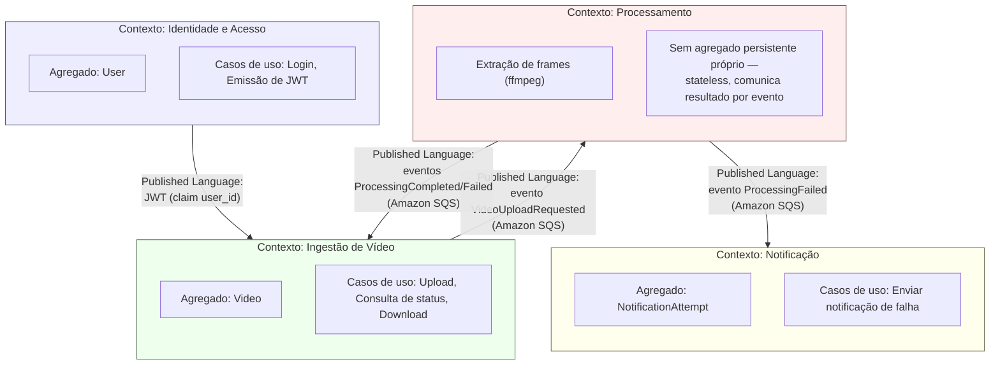

# Context Map — Sistema de Processamento de Vídeos (FIAP X)

> [!NOTE]
> **Relação com a decomposição em serviços**
> Fiz os 3 serviços (`video-api`, `video-worker`, `notification-worker`) cobrirem **4 bounded contexts** — `video-api` na verdade hospeda dois contextos (Identidade e Ingestão de Vídeo) no mesmo processo, por decisão pragmática minha de hackathon (ver [ADR-001](../architecture/hld-lld-adr-rfc.md#adr-001--estilo-arquitetural-para-o-hackathon)), não porque sejam o mesmo contexto de domínio.

## Relações entre contextos (padrões táticos de DDD)

| De → Para | Padrão | Por quê |
|---|---|---|
| Identidade → Ingestão | **Conformist** (Ingestão aceita o formato de token que Identidade emite, sem traduzir) | Hospedo os dois no mesmo serviço (`video-api`) por decisão de escopo de hackathon — não há fronteira de rede real hoje, mas a fronteira *conceitual* de domínio existe e a mantenho no código (módulos/pacotes separados) |
| Ingestão → Processamento | **Customer/Supplier**, comunicação via **Published Language** (eventos Amazon SQS, não chamada direta) | Ingestão é upstream: define o contrato do evento `VideoUploadRequested`. Processamento é downstream e consome esse contrato — nunca lê o Postgres de Ingestão diretamente |
| Processamento → Ingestão | **Published Language** (eventos `ProcessingCompleted`/`ProcessingFailed`) | Inverte a direção do fluxo anterior: aqui é Processamento quem publica, Ingestão quem consome e aplica ao seu próprio estado — ver [ADR-008](../architecture/hld-lld-adr-rfc.md#adr-008--comunicação-de-status-entre-video-worker-e-video-api-evento-não-escrita-direta). Nenhum dos dois lados acessa o banco do outro em nenhuma direção |
| Processamento → Notificação | **Published Language** (evento `ProcessingFailed`) | Notificação é puramente reativa a esse evento — não tem conhecimento de Vídeo, Job ou Usuário além do que vem no payload do evento |

## Por que 4 contextos convivendo em só 3 serviços

Um domínio com contextos genuinamente distintos e fluxo transacional multi-etapa (ex.: orçamento → aprovação → execução → pagamento) justificaria um serviço próprio por contexto, com Saga para compensação — não considero esse o caso aqui. Os 4 contextos existem (a fronteira de domínio é real e está mapeada acima), mas fiz **2 deles conviverem no mesmo processo** (`video-api`) porque a comunicação entre Identidade e Ingestão é síncrona, local e sem necessidade de escalar independentemente — ao contrário de Processamento, que é a única parte genuinamente CPU-bound e precisa escalar sozinha. É a mesma decisão que já registrei no [ADR-001](../architecture/hld-lld-adr-rfc.md#adr-001--estilo-arquitetural-para-o-hackathon), agora explicada pela lente de bounded contexts em vez de só "quantos serviços".

## Referências

- [Event Storming](./event-storming.md)
- [Linguagem Ubíqua](./linguagem-ubiqua.md)
- [Domain Storytelling](./domain-storytelling.md)
- [Documentação de Arquitetura (HLD, LLD, ADR, RFC)](../architecture/hld-lld-adr-rfc.md)
