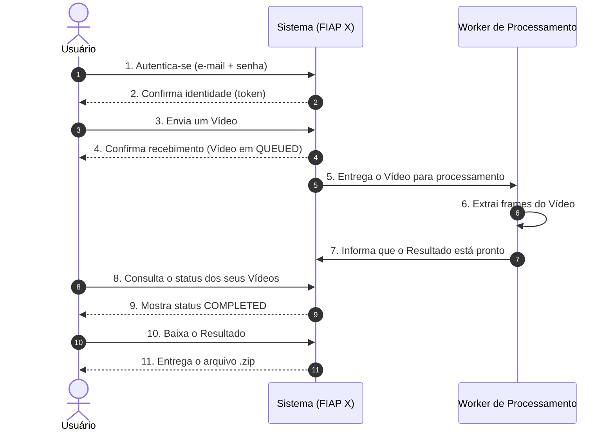
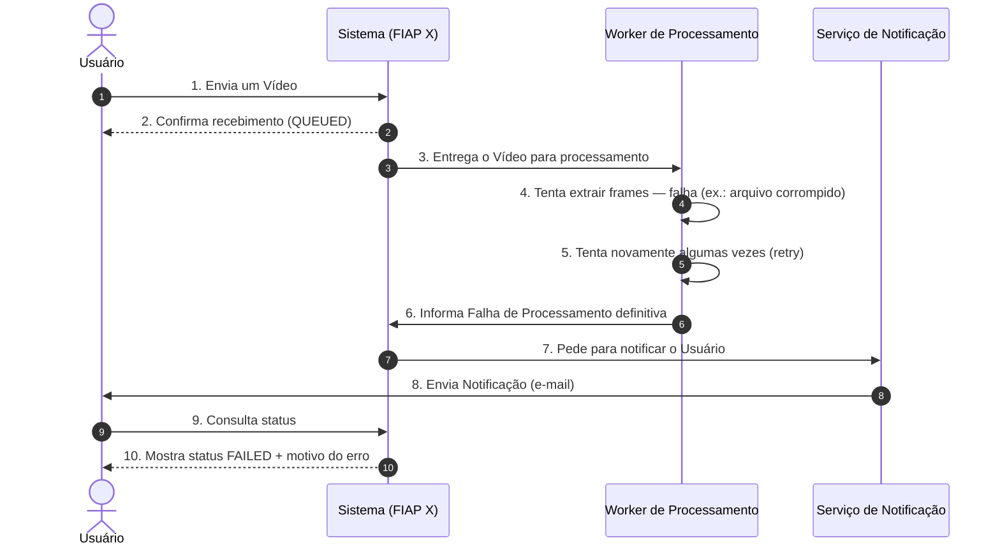

# Domain Storytelling — Jornada do Usuário

> [!NOTE]
> **Formato**
> Narro aqui a jornada em linguagem de negócio, na ordem em que acontece, usando os substantivos/verbos da [Linguagem Ubíqua](./linguagem-ubiqua.md) — este documento complementa o [Event Storming](./event-storming.md) (que organizei por evento/agregado, não por narrativa cronológica única).

## História 1 — Caminho feliz

**Narrativa:** *O Usuário se autentica no Sistema e envia um Vídeo. O Sistema confirma o recebimento imediatamente, sem fazer o Usuário esperar o processamento. Em paralelo, o Sistema entrega o Vídeo para um Worker de Processamento, que extrai os frames. Quando o Worker termina, ele informa o Sistema, que atualiza o status do Vídeo. O Usuário, a qualquer momento, pode consultar o status de todos os seus Vídeos e, quando um deles estiver pronto, baixar o Resultado.*

## História 2 — Caminho de falha

**Narrativa:** *Quando o Worker não consegue extrair os frames de um Vídeo mesmo após tentar novamente, ele informa o Sistema de uma Falha de Processamento definitiva. O Sistema então aciona o Serviço de Notificação, que avisa o Usuário por e-mail. Diferente do caminho feliz, aqui o Usuário é avisado ativamente — não precisa ficar consultando o status para descobrir que algo deu errado.*

## O que esta narrativa deixa claro (e o Event Storming, sozinho, não)

- O Usuário **nunca espera** o processamento terminar dentro da mesma interação (passo 4 da História 1 acontece "em paralelo", não bloqueia o passo 4→resposta). Essa é a diferença central entre o baseline antigo (síncrono) e o sistema novo.
- A notificação (História 2, passo 7-8) é **iniciativa do Sistema**, não uma resposta a uma pergunta do Usuário — por isso é um fluxo assíncrono desacoplado, não mais um `GET` que o Usuário faria.

## Referências

- [Event Storming](./event-storming.md)
- [Linguagem Ubíqua](./linguagem-ubiqua.md)
- [Context Map](./context-map.md)
