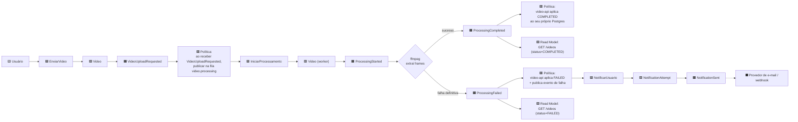

# Event Storming — Sistema de Processamento de Vídeos (FIAP X)

> [!NOTE]
> **Formato**
> Equivalente textual/mermaid a um board de Event Storming (Miro), conforme aceito pela Fase 1 ("Miro ou equivalente").
>
> **Convenção de cores do método**: 
> - 🟧 Evento de Domínio
> - 🟦 Comando
> - 🟨 Ator/Persona
> - 🟪 Agregado
> - 🟩 Read Model
> - 🟥 Política (regra reativa)
> - ⬛ Sistema Externo.

## 1. Linha do tempo — fluxo feliz e fluxo de falha

## 2. Atores

| Ator           | O que faz                                                |
|----------------|----------------------------------------------------------|
| 🟨 **Usuário** | Autentica, envia Vídeo, consulta status, baixa Resultado |

> Não há ator "Administrador" no escopo atual.

## 3. Comandos e quem os dispara

| Comando                | Disparado por                                     | Pré-condição                                       |
|------------------------|---------------------------------------------------|----------------------------------------------------|
| `EnviarVideo`          | Usuário (via `POST /videos`)                      | Usuário autenticado; arquivo em formato suportado  |
| `IniciarProcessamento` | Sistema (consumidor da fila `video.processing`)   | Mensagem `VideoUploadRequested` disponível na fila |
| `NotificarUsuario`     | Sistema (consumidor da fila `video.notification`) | Evento `ProcessingFailed` recebido                 |

## 4. Eventos de domínio (ver definição formal em [Linguagem Ubíqua](./linguagem-ubiqua.md))

`VideoUploadRequested` → `ProcessingStarted` → (`ProcessingCompleted` **ou** `ProcessingFailed`) → `NotificationSent` (só no caminho de falha)

## 5. Agregados

| Agregado                | Invariantes que protege                                                                                                                                                                                                           |
|-------------------------|-----------------------------------------------------------------------------------------------------------------------------------------------------------------------------------------------------------------------------------|
| **Video**               | Só pode ter um `status` por vez, transições válidas: `QUEUED → PROCESSING → {COMPLETED, FAILED}` (sem pular etapas, sem regressão). Pertence a exatamente um `user_id`. Concorrência protegida por optimistic locking (`version`) |
| **NotificationAttempt** | Um registro por tentativa de canal (e-mail, webhook), nunca reenvia se já houve `NotificationSent` para aquele `video_id` + canal (idempotência)                                                                                  |

> [!WARNING]
> **Decisão registrada**
> Não existe um agregado `Job` separado de `Video` — ver nota aberta em [Linguagem Ubíqua](./linguagem-ubiqua.md). O "job" é modelado como o próprio ciclo de vida do `Video`. Isso é suficiente para o domínio atual (não há reprocessamento paralelo do mesmo vídeo, não há histórico de múltiplas tentativas de job por vídeo além do que a DLQ já resolve).

## 6. Políticas (regras reativas — "quando X, então Y")

| Política                  | Gatilho                                               | Ação                                                                                                                                                                                                                                       |
|---------------------------|-------------------------------------------------------|--------------------------------------------------------------------------------------------------------------------------------------------------------------------------------------------------------------------------------------------|
| Enfileirar após upload    | `VideoUploadRequested` publicado no outbox            | Publisher agendado envia para `video.processing`                                                                                                                                                                                           |
| Aplicar conclusão         | `ProcessingCompleted` recebido pelo `video-api`       | Atualiza `status=COMPLETED` no Postgres do `video-api` — **não** é o worker que escreve direto (ver [ADR-008](../architecture/hld-lld-adr-rfc.md#adr-008--comunicação-de-status-entre-video-worker-e-video-api-evento-não-escrita-direta)) |
| Aplicar falha e notificar | `ProcessingFailed` recebido pelo `video-api`          | Atualiza `status=FAILED` + publica evento de falha em `video.notification`                                                                                                                                                                 |
| Retry com backoff         | Falha transitória no worker (ex.: MinIO indisponível) | Retry exponencial (Resilience4j); só vira `ProcessingFailed` após esgotar tentativas                                                                                                                                                       |
| Dead-letter               | Mensagem falha após `maxReceiveCount`                 | Vai para a DLQ correspondente (`video.processing.dlq` / `video.notification.dlq`)                                                                                                                                                          |

## 7. Read Models

| Read Model                     | Endpoint                    | Fonte                                                      |
|--------------------------------|-----------------------------|------------------------------------------------------------|
| Listagem de status por usuário | `GET /videos`               | Postgres do `video-api`, cache-aside via Redis             |
| Detalhe de um vídeo            | `GET /videos/{id}`          | Postgres do `video-api`                                    |
| Download do resultado          | `GET /videos/{id}/download` | URL pré-assinada do MinIO/S3, só quando `status=COMPLETED` |

## 8. Pontos de incerteza (hotspots — convenção do método: 🟪 rosa/roxo escuro)

- **Tamanho máximo de vídeo aceito** — decisão de produto em aberto, já registrada como risco no RFC principal.
- **Backpressure sob fila sobrecarregada** (`429 Too Many Requests`) — desenhado mas não implementado por padrão no MVP (ver ADR-001).

## Referências

- [Linguagem Ubíqua](./linguagem-ubiqua.md)
- [Domain Storytelling](./domain-storytelling.md)
- [Context Map](./context-map.md)
- [Documentação de Arquitetura (HLD, LLD, ADR, RFC)](../architecture/hld-lld-adr-rfc.md)
